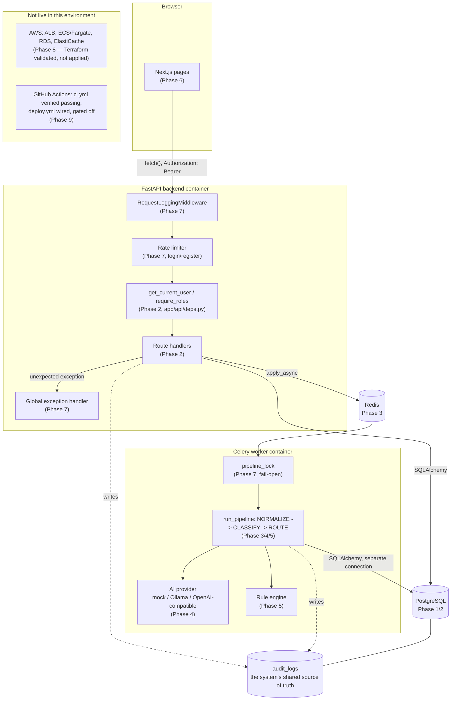

# Phase 10 — Complete System Integration

## 1. What This Phase Is

Every phase from 1 through 9 built or hardened one layer of FlowForge. This phase builds **nothing new** — no code changes, no new features. Its entire job, per the spec, is to connect everything already built into one coherent mental model by tracing real scenarios end to end, naming the actual file and function responsible for each step. If a claim in this document can't be traced to a real line of code that already exists, it doesn't belong here — that's the whole discipline of this phase.

## 2. Why This Phase Exists

Knowing how to build `app/services/request_service.py` and knowing how the *entire system* behaves when a request moves through it are different skills. An interview question is almost never "show me the code for X" — it's "walk me through what happens when a user does Y," across every layer, including the parts that fail. This phase is deliberate rehearsal for exactly that.

## 3. The Whole-System Mental Model, in One Paragraph

A browser talks to two things and two things only: the Next.js frontend (serving pages) and the FastAPI backend (serving data) — never to Postgres, Redis, or Celery directly. FastAPI does the minimum necessary synchronously (validate, persist, enqueue) and returns immediately; everything slow or uncertain (AI classification, rule evaluation, routing) happens later, in a Celery worker, talking to the same Postgres database through a completely separate connection. The **audit log is the spine connecting every layer** — every meaningful thing any component does, it writes down, which is what makes "trace this request" a real, answerable question instead of an archaeology project through scattered logs. Authorization is enforced exactly once, for real, at the backend (`app/api/deps.py`) — the frontend's route guards are UX, not security. Nothing here is deployed to real cloud infrastructure (Phase 8) yet, and the CI/CD pipeline (Phase 9) that would ship changes there is verified working but has never actually shipped anything, by design, since no AWS account is connected.

## 4. Complete Architecture Diagram

## 5. Scenario A — Normal Request

**User logs in → creates a request → it gets classified, routed, and a task is created.**

1. **UI**: `frontend/src/app/login/page.tsx` submits the login form → `authService.login()` (`frontend/src/lib/services/auth.ts`) → `apiFetch("/api/auth/login", { skipAuth: true })` (`frontend/src/lib/api.ts`).
2. **FastAPI**: `login()` (`backend/app/api/routes/auth.py`) — rate-limited (`@limiter.limit`, Phase 7) — verifies the password (`verify_password`, `backend/app/core/security.py`), returns a JWT (`create_access_token`).
3. **Frontend stores the token**: `setToken()` (`frontend/src/lib/auth-storage.ts`), `AuthContext` (`frontend/src/contexts/AuthContext.tsx`) fetches `/api/auth/me` to confirm it's real, sets `user` state.
4. **UI**: user fills out `frontend/src/app/requests/new/page.tsx`, submits → `requestsService.createRequest()` → `POST /api/requests` with `Authorization: Bearer <token>`.
5. **FastAPI**: `create_request()` (`backend/app/api/routes/requests.py`) — `get_current_user` (`backend/app/api/deps.py`) resolves the token to a `User` row — `request_service.create_request()` (`backend/app/services/request_service.py`) inserts the `Request` row, calls `audit_service.record_event(event_type="REQUEST_CREATED", ...)`, commits.
6. **Enqueue**: `_enqueue_processing()` (same file) calls `process_request.apply_async(...)` (`backend/app/workers/tasks.py`) — this hits Redis, not Postgres. The HTTP response (`201`, `processing_status: "QUEUED"`) is returned **here** — before any AI work has happened, the entire point of Phase 3.
7. **Celery worker** (a separate OS process, in the `celery-worker` container) receives the task from Redis, calls `process_request()` → acquires `pipeline_lock()` (`backend/app/services/locking.py`, Phase 7) → calls `_run_pipeline_locked()` (`backend/app/services/processing_service.py`).
8. **NORMALIZE stage**: `normalize_text()` collapses whitespace, writes `TEXT_NORMALIZED` to `audit_logs`, commits.
9. **CLASSIFY stage**: `ai_provider.classify()` (`backend/app/ai/providers/mock.py` by default) returns a validated `AIClassificationResult` (`backend/app/ai/schemas.py`) — category, priority, confidence, entities persisted onto the `Request` row and into `extracted_entities`; `AI_CLASSIFICATION_COMPLETED`, `INFORMATION_EXTRACTED`, `VALIDATION_COMPLETED` written to `audit_logs`.
10. **ROUTE stage**: `_route_request()` calls `evaluate_rules()` (`backend/app/rules/engine.py`) against the real `workflow_rules` rows — every rule checked is recorded in one `RULE_EVALUATION_COMPLETED` entry; each rule that actually fired gets its own `RULE_TRIGGERED` entry. If a team was determined: `request.assigned_team` set, `status = PROCESSING`, a real `WorkflowTask` row created, `REQUEST_ROUTED` and `TASK_CREATED` written.
11. **Pipeline finishes**: `processing_status = COMPLETED`, `PROCESSING_COMPLETED` written.
12. **Frontend**: `frontend/src/app/requests/[id]/page.tsx`'s polling `useEffect` (active because `processing_status` was `QUEUED`/`IN_PROGRESS`) refetches on its next 3-second tick and renders the final state — AI analysis, workflow, and the full timeline — with zero manual refresh.
13. **Dashboard**: the next time anyone loads `/dashboard`, `dashboard_service.get_summary()`/`get_metrics()` (`backend/app/services/dashboard_service.py`) run real aggregate queries against the now-updated `requests` table — there is no cache to invalidate, because nothing was ever cached.

*Live-verified, this exact flow, multiple times*: Phase 5's finance-approval-threshold example, Phase 6's access-request browser session, and Phase 7's integration test `test_request_is_actually_classified_and_routed_by_the_real_worker` all exercised this precise path against real infrastructure.

## 6. Scenario B — Low AI Score

**A request gets classified, but with low confidence — deterministic rules, not the AI, decide what happens next.**

1. Steps 1–9 from Scenario A happen identically — the AI still classifies the request and still returns a result; a low `confidence` value is not, by itself, an error (`backend/app/ai/schemas.py`'s `confidence` field just requires `0.0 <= x <= 1.0`).
2. **ROUTE stage**, `evaluate_rules()`: the seeded rule `"Low Confidence Manual Review"` (`backend/app/seed.py`) has condition `confidence < 0.70`. If true, this rule's action `status = MANUAL_REVIEW` is recorded as a **terminal** action (`backend/app/rules/engine.py`'s `_TERMINAL_STATUS_PRECEDENCE`).
3. **Critical point, worth stating explicitly**: even if *another* rule in the same evaluation pass also matched and would have assigned a team, `_route_request()` (`backend/app/services/processing_service.py`) checks `result.terminal_status is not None` *first* — a terminal status always wins over team assignment, regardless of rule order. This is the concrete mechanism behind "the AI doesn't decide, the rule engine does": low confidence is a *data point* the rule engine chose to act on, via a rule an admin can inspect, edit, or disable through `/api/rules` (Phase 2) or the `/rules` admin UI (Phase 6) — never a hardcoded `if confidence < 0.7` buried in Python.
4. `request.status = MANUAL_REVIEW`; `REQUEST_ROUTED` audit entry written with description `"Routed to MANUAL_REVIEW — no team assignment made"`. No `WorkflowTask` is created.
5. **Operator reviews**: an `OPERATOR`/`ADMIN` opens `frontend/src/app/requests/[id]/page.tsx` — the "Staff actions" panel (rendered only for `isStaff`) shows the AI analysis, the full timeline (including exactly which rule fired and why), and two real actions: **retry** (`retryRequest()` → `POST /api/requests/{id}/retry`, eligible here because `status === "MANUAL_REVIEW"` — `backend/app/api/routes/requests.py`'s `retryable_statuses` check) or **resolve** (`updateRequest({status: ...})` → `PATCH /api/requests/{id}`, allowed for staff regardless of current status).
6. **Live-verified**: this exact path — a seeded low-confidence request landing in `MANUAL_REVIEW` with zero task created, three rules evaluated but only the terminal one taking effect — was directly observed via `psql` and the timeline API in Phase 5's live testing.

## 7. Scenario C — AI Failure

**The AI provider itself fails — not a bad answer, no answer at all.**

1. Steps 1–8 from Scenario A happen identically through NORMALIZE.
2. **CLASSIFY stage**: `ai_provider.classify()` raises `AIProviderError` (`backend/app/ai/exceptions.py`) — a real network/timeout failure (with `AI_PROVIDER=ollama`, this is exactly what a stopped or overloaded Ollama server produces; live-verified in Phase 4 with a genuine ~30s timeout on a cold model).
3. `run_pipeline`'s `except (AIProviderError, AIOutputValidationError)` branch (`backend/app/services/processing_service.py`) calls `_fail_stage()`: rolls back, marks that `ProcessingRun` `FAILED`, writes `PROCESSING_FAILED`, **re-raises**.
4. **Back in `app/workers/tasks.py::process_request`**: the exception is caught explicitly. `self.retry(exc=exc, countdown=...)` re-queues the task — visible, live, as `celery_task_ai_failure_retrying attempt=1` in the worker's own logs (Phase 4).
5. **If it keeps failing past the retry budget**: `self.retry()` raises `MaxRetriesExceededError`, caught by `tasks.py`, which calls `processing_service.mark_manual_review()` — sets `request.status = MANUAL_REVIEW` (a **different** path to the same status as Scenario B, distinguishable in the audit trail: `actor="celery-worker"` and a `MANUAL_REVIEW_REQUIRED` description naming the specific exception, versus Scenario B's `actor="rule-engine"`).
6. **What the user sees**: exactly the same UI as Scenario B — a request in `MANUAL_REVIEW`, full timeline, staff retry/resolve actions — but an operator reading the timeline can tell *which kind* of manual review this is (a rule's deliberate decision vs. a technical failure) from the audit entries alone.
7. **Live-verified, precisely**: Phase 4's session watched this exact retry-then-succeed cycle happen for real against a genuinely slow Ollama server — the first attempt timed out, `self.retry()` fired, the second attempt succeeded, and the full before/during/after audit trail was inspected directly.

## 8. Scenario D — Database Failure

**Two independent traces: the API talking to Postgres, and the worker talking to Postgres.**

**API → database → error → response:**

1. `GET /api/health` (`backend/app/api/routes/health.py`) runs a real `SELECT 1`. If Postgres is unreachable, the `try/except` catches it, `database_status = "down"`, and the response is `503` with `{"status": "degraded", "database": "down"}` — not a generic crash.
2. Any *other* endpoint hitting a database error mid-request (not caught by a more specific handler) falls through to `unhandled_exception_handler` (`backend/app/main.py`, Phase 7) — logs the full exception with the request's `request_id`, returns a generic `500` body, never leaks the raw database error to the client.
3. **Live-verified, Phase 7**: `docker compose stop postgres` → `curl /api/health` → confirmed `503`/`degraded` instantly. Restarted Postgres → confirmed `200`/`ok` within seconds, no manual intervention.

**Celery → database → error → retry/failure handling:**

1. If Postgres becomes unreachable *during* `run_pipeline`, the `except OperationalError: db.rollback(); raise` branches (present at every stage in `backend/app/services/processing_service.py`) deliberately do **not** try to write a failure record to the same unreachable database — they just roll back and propagate.
2. `app/workers/tasks.py`'s `@celery_app.task(autoretry_for=(OperationalError,), ...)` catches it at the Celery level and retries with backoff automatically — no custom retry logic needed for this specific case, unlike the AI-failure path in Scenario C, which needed explicit handling because a decision (retry vs. give up) had to be made.
3. **Live-verified, Phase 7, and directly relevant to Scenario C**: the *closely related* Redis-outage investigation (an unresolved, honestly-documented ~105s slow-fail — `docs/learning/PHASE_7_PRODUCTION_ENGINEERING.md` section 7) is the single most instructive failure-mode story in this project — proof that "the system detects and recovers from X" isn't always a clean, fully-solved story, and that's a real, valuable thing to be able to explain rather than hide.

## 9. Scenario E — Unauthorized User

**A `USER` attempts an `ADMIN`-only operation — traced end to end, at both layers.**

1. **UI layer (not the real security boundary)**: if a `USER` navigates to `frontend/src/app/rules/page.tsx`, `RequireAuth roles={["ADMIN"]}` (`frontend/src/components/auth/RequireAuth.tsx`) checks `user.role` against the allowed list and `router.replace("/dashboard")`s before the page ever renders — live-verified in Phase 6's browser session.
2. **What actually stops a direct API call** (the real boundary, working even if the frontend guard were deleted entirely, or bypassed with `curl`): `POST /api/rules` (`backend/app/api/routes/rules.py`) declares `_current_user: User = Depends(admin_only)`, where `admin_only = require_roles(UserRole.ADMIN)` (`backend/app/api/deps.py`).
3. **Inside `require_roles`'s inner `dependency()` function**: `get_current_user` resolves the JWT to a real `User` row first (a `USER` role is still a *valid, authenticated* user — this is authentication succeeding). Then: `if current_user.role not in allowed_roles: raise HTTPException(403, ...)`. This is where authentication (who are you) and authorization (what are you allowed to do) are concretely, visibly two separate steps in the same dependency chain — not the same check.
4. **Response**: `403 Forbidden`, generic detail message, no information about what an admin *would* have seen.
5. **A related, deliberately different case — ownership, not role**: a `USER` fetching *another* `USER`'s own request (`GET /api/requests/{id}`) isn't a role problem (both are `USER`s) — `_ensure_can_view()` (`backend/app/api/routes/requests.py`) checks `request.requester_id != current_user.id` and raises `404`, not `403` — deliberately, to avoid confirming the resource even exists (Phase 2's IDOR mitigation, live-verified with two real user accounts in Phase 2/6 browser sessions).
6. **Live-verified, Phase 2, Phase 6, and Phase 7's `test_regular_user_cannot_update_task`/similar integration-adjacent tests**: every one of these exact 403/404 boundaries has been exercised against a real running backend, not just asserted in an isolated unit test.

## 10. What Ties It All Together

Four ideas, each shown concretely in more than one scenario above, are the actual architectural spine of this project:

1. **The audit log is the shared source of truth.** Every scenario above was traceable specifically *because* every meaningful state change writes to `audit_logs`, from the same `audit_service.record_event()` function, in the same transaction as the change it describes. This is why Scenario B and Scenario C can both end in `MANUAL_REVIEW` and still be distinguishable — the audit trail carries the *reason*, not just the *state*.
2. **The AI is never the last word.** Scenario A and Scenario B trace the exact same AI output through two different outcomes, determined entirely by `app/rules/engine.py` evaluating database-stored rules — never by a threshold hardcoded next to the AI call itself.
3. **Failures are handled deliberately, not uniformly.** Scenario C (AI failure) and Scenario D (database failure) look similar on the surface — "something downstream broke" — but are handled by genuinely different code paths with different reasoning (explicit retry-then-manual-review for AI, automatic `autoretry_for` for the database), because they're genuinely different kinds of failure with different correct responses. Phase 7's Redis investigation is the sharpest example of taking this reasoning seriously even when it doesn't resolve cleanly.
4. **Every boundary this project claims is real has been exercised against a real, running system** — not just asserted in isolated unit tests. This document doesn't introduce a single new claim; every numbered step above cites a phase where it was actually watched happening.

## 11. Interview Questions

- Pick any one of the five scenarios above and re-trace it from memory, file by file, without looking.
- Scenario B and Scenario C both end with `status = MANUAL_REVIEW`. What's actually different about how each got there, and how would you tell them apart just by reading the audit log?
- Where, precisely, does authentication end and authorization begin in Scenario E's trace?
- Why does the database-failure handling inside `run_pipeline` deliberately *not* try to record its own failure when the failure is `OperationalError` specifically?
- If you had to add a sixth scenario to this document, which real, already-built behavior would you choose, and why does it deserve one?

## 12. Phase Checklist

- [x] Five scenarios traced, each citing real files and functions that exist in this exact codebase today
- [x] Every trace connects to at least one phase where the behavior was actually live-verified, not just written
- [x] The AI-vs-rule-engine boundary and the authentication-vs-authorization boundary are each shown concretely, not just asserted
- [x] No new application code was written for this phase — consistent with the spec's own framing of Phase 10 as synthesis, not construction

We'll verify this together when you're ready — starting with picking any scenario above and re-tracing it without looking at this document.
