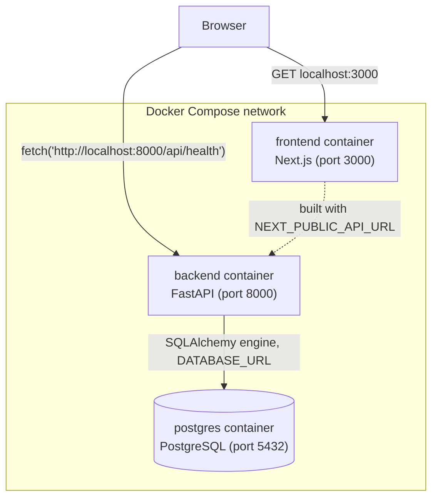

# Phase 1 — Foundations

## 1. What We Built

A minimal but real full-stack skeleton:

- A **FastAPI** backend (`backend/`) with a health check and working JWT authentication (register, login, "who am i") backed by a real **PostgreSQL** database.
- A **Next.js** frontend (`frontend/`) with one page that calls the backend over HTTP and shows live status.
- **Alembic** migrations that create the `users` table (no auto-create-on-startup shortcuts).
- A **Docker Compose** stack (`docker-compose.yml`) that runs Postgres, the backend, and the frontend as three networked containers, each with a health check.
- A **pytest** suite (`backend/tests/`) covering health, registration, login, authorization, and the password/JWT utilities.

Nothing here does AI classification, queues, or business rules yet — that starts in Phase 3 onward. Phase 1 is purely about wiring: can the browser talk to the frontend, the frontend to the backend, the backend to the database, and can all of that be reproduced from a clean checkout with one command?

## 2. Why This Phase Exists

Every later phase adds a *feature*. Phase 1 has no feature — it proves the *plumbing* works, because every feature will run through this plumbing. If you don't understand how a request gets from a browser to Postgres and back, you can't debug anything built on top of it. This is deliberately the most "boring" phase and the most load-bearing one.

## 3. Prerequisites

You already know Python, JavaScript, SQL basics, OOP, and Git. You do **not** yet know FastAPI, PostgreSQL internals, Docker, Docker networking, Next.js, or JWT — this document teaches those from first principles as they come up.

## 4. Core Concepts

### HTTP and REST, briefly

A web API is just a program that listens on a port and responds to HTTP requests — text messages with a method (`GET`, `POST`, ...), a path (`/api/auth/login`), headers, and an optional body. REST is a convention for designing these APIs: resources are nouns (`/api/requests`), the HTTP method is the verb (`POST` creates, `GET` reads, `PATCH` updates), and the response status code tells the caller what happened (`200` ok, `201` created, `401` not authenticated, `404` not found, `422` bad input). FlowForge follows this convention everywhere — see `backend/app/api/routes/auth.py` for concrete examples of status codes being chosen deliberately (`201` on register, `409` on duplicate email, `401` on bad credentials).

### FastAPI

FastAPI is a Python web framework built around **type hints**. You declare what a request body should look like as a Pydantic class (`backend/app/schemas/user.py`), and FastAPI: (1) parses incoming JSON into that class, (2) rejects anything that doesn't match the shape with a `422` automatically, (3) generates interactive API docs from the same declaration (visit `/docs` on the running backend). This is why there is no manual `if "email" not in body` validation anywhere in `auth.py` — the schema *is* the validation.

FastAPI also has a **dependency injection** system: any route can declare `db: Session = Depends(get_db)` as a parameter, and FastAPI calls `get_db` for you and hands the result in. This is how `backend/app/core/database.py`'s `get_db` and `backend/app/api/deps.py`'s `get_current_user` get wired into routes without every route importing and constructing them manually.

### PostgreSQL and SQL, as used here

Postgres is a relational database: data lives in typed, related tables. The `users` table (defined in `backend/app/models/user.py`, created by `backend/alembic/versions/0001_create_users_table.py`) has columns `id`, `name`, `email`, `password_hash`, `role`, `created_at`, `updated_at`. The `email` column has a `UNIQUE` index (`ix_users_email`) — that's what makes the database itself reject a duplicate email at the storage layer, not just application code.

### SQLAlchemy, minimally

SQLAlchemy is an ORM (object-relational mapper): it lets you write `db.query(User).filter(User.email == payload.email).first()` (see `auth.py`) instead of raw SQL strings, while still ultimately sending SQL to Postgres. `backend/app/core/database.py` defines the `engine` (the thing that knows how to open connections to the `DATABASE_URL`), a `SessionLocal` factory (each request gets its own `Session` — a unit-of-work / transaction scope), and `Base` (the parent class every ORM model inherits from so SQLAlchemy knows about all your tables).

### Alembic and migrations

If you changed the `User` Python class today, the actual `users` table in Postgres wouldn't change — Python classes and database tables are two different things kept in sync manually. Alembic is the tool that keeps them in sync via **migrations**: versioned, ordered scripts (`backend/alembic/versions/0001_create_users_table.py`) that each describe an `upgrade()` (apply this change) and `downgrade()` (undo it). Running `alembic upgrade head` applies every migration not yet applied, in order, and Postgres itself tracks which ones have run (in a hidden `alembic_version` table) — that's why restarting the backend container and re-running the migration command is safe and a no-op (you saw this yourself in the "restart backend" test).

The spec explicitly forbids calling `Base.metadata.create_all()` at app startup as a shortcut. That call *would* create the tables, but it can't express "add this column," "rename that one," or "backfill this data" — real schema evolution needs migrations, so Phase 1 sets up the real thing immediately rather than a shortcut you'd have to rip out later.

### JWT authentication

JWT (JSON Web Token) is a signed, self-contained string. `backend/app/core/security.py`'s `create_access_token` packs `{sub: user_id, role: ..., exp: ...}` into a token and signs it with `JWT_SECRET_KEY`. The server never stores this token anywhere — anyone holding a validly-signed token proves who they are just by presenting it. `decode_access_token` verifies the signature and expiry; if either is wrong, it returns `None` rather than raising, so callers can't accidentally skip error handling.

The flow: `POST /api/auth/login` checks the password and returns a token. The client stores it and sends it back as `Authorization: Bearer <token>` on later requests. `get_current_user` (`backend/app/api/deps.py`) is a FastAPI dependency that pulls the token out of that header (via `OAuth2PasswordBearer`), decodes it, and loads the matching `User` row — any route that declares `current_user: User = Depends(get_current_user)` is now "protected" for free.

Passwords are never stored or compared directly — `hash_password`/`verify_password` in `security.py` use bcrypt (via `passlib`), a deliberately slow, salted hashing algorithm designed to resist offline brute-force even if the database leaks.

### Docker and Docker Compose

A **Dockerfile** is a recipe for building an **image** — a frozen filesystem snapshot containing your app and everything it needs to run (see `backend/Dockerfile`, `frontend/Dockerfile`). A **container** is a running instance of an image — isolated from your host machine's filesystem and processes, but able to talk over the network. `docker-compose.yml` describes a set of containers that should run together as one system: `postgres`, `backend`, `frontend`. Compose creates a private network so containers can address each other by service name (the backend's `DATABASE_URL` points at host `postgres`, not `localhost`, because from inside the backend container, `postgres` is a DNS name Compose resolves to the Postgres container's IP). `depends_on: condition: service_healthy` makes the backend wait until Postgres's `HEALTHCHECK` passes before starting — otherwise the backend could try to connect before Postgres has finished starting up.

### Health checks

A health check is an endpoint (`GET /api/health` in `backend/app/api/routes/health.py`) that reports whether a service is actually working, not just "the process is running." Ours runs `SELECT 1` against the real database — if Postgres is unreachable, it returns HTTP `503` instead of `200`. This is what Docker's `HEALTHCHECK` directive polls, and it's the same pattern a cloud load balancer will use in Phase 8 to decide whether to route traffic to an instance.

## 5. Mental Model

Think of the system as four independent programs that only know about each other through network calls and environment variables:

- **Postgres** knows nothing about FastAPI. It just accepts SQL over a TCP port.
- **FastAPI (backend)** knows nothing about Next.js. It just accepts HTTP over a TCP port, and happens to know how to reach *a* Postgres at whatever `DATABASE_URL` says.
- **Next.js (frontend)** knows nothing about how the backend is implemented. It just fetches HTTP from whatever `NEXT_PUBLIC_API_URL` says.
- **Docker Compose** is not a fourth program — it's the thing that starts the other three, wires their private network, and injects the environment variables that tell each one where to find the others.

This separation is why the stack is "reproducible from a clean checkout": nothing hardcodes an address, and every dependency between services is declared, not assumed.

## 6. Architecture Diagram

Note the dotted line: the frontend does not proxy requests through itself to the backend. The **browser** calls FastAPI directly, at the URL baked into the frontend at build time. This matters for debugging: if the backend is down, it's the browser's network tab that shows the failure, not a Next.js server log.

## 7. Request/Data Flow

Trace of "load the homepage and see backend status," per the Teaching Guide's required format:

1. **Browser → Next.js**: You navigate to `http://localhost:3000`. The frontend container (already built and running) serves the pre-rendered HTML for `frontend/src/app/page.tsx`.
   - *File*: `frontend/src/app/page.tsx`
   - *Can fail*: frontend container not running, port not published. *Debug*: `docker compose ps`, `docker compose logs frontend`.

2. **Browser renders `BackendStatus`, a Client Component**: The `"use client"` directive at the top of `frontend/src/components/BackendStatus.tsx` means this component's code ships to the browser and runs there (as opposed to only on the server) — necessary because it needs `useEffect`/`useState` to fetch *after* the page has loaded.
   - *File*: `frontend/src/components/BackendStatus.tsx`

3. **Browser → FastAPI**: `useEffect` calls `apiFetch("/api/health")` (`frontend/src/lib/api.ts`), which does a plain `fetch` to `${NEXT_PUBLIC_API_URL}/api/health` — i.e., `http://localhost:8000/api/health`, requested directly by the browser, not proxied through the Next.js server.
   - *File*: `frontend/src/lib/api.ts`
   - *Can fail*: backend down, wrong `NEXT_PUBLIC_API_URL` baked in at build time, CORS rejection. *Debug*: browser dev tools Network tab; check `Access-Control-Allow-Origin` header; check `backend/app/core/config.py`'s `CORS_ORIGINS`.

4. **FastAPI routing**: `backend/app/main.py` has already registered `health.router` (prefix `/api`) via `app.include_router(...)`, so the `GET /api/health` request is dispatched to `health_check` in `backend/app/api/routes/health.py`.

5. **Dependency injection resolves a DB session**: `health_check`'s signature includes `db: Session = Depends(get_db)`. FastAPI calls `get_db` (`backend/app/core/database.py`) first, which opens a `SessionLocal()` and yields it.

6. **FastAPI → PostgreSQL**: `health_check` runs `db.execute(text("SELECT 1"))`. SQLAlchemy sends this over the TCP connection defined by `DATABASE_URL` to the `postgres` container.
   - *Can fail*: Postgres container down, wrong credentials, network partition. *Debug*: `docker compose logs postgres`; the `except Exception` branch in `health_check` catches this and reports `"database": "down"` with HTTP `503` rather than crashing.

7. **Response flows back**: Postgres → FastAPI → JSON `{"status": "ok", "database": "up"}` → browser's `fetch` promise resolves → `setState({kind: "success", data})` → React re-renders `BackendStatus` with the green dot.
   - *File*: `frontend/src/components/BackendStatus.tsx` (the `StatusCard` render logic)

Auth flow (`register` → `login` → `me`) follows the same shape, just through `backend/app/api/routes/auth.py` instead of `health.py`, and with the extra steps of password hashing (`security.py::hash_password`) on register and JWT creation/verification (`security.py::create_access_token` / `decode_access_token`) on login/me.

## 8. Codebase Mapping

| Layer | File | Responsibility |
|---|---|---|
| App entrypoint | `backend/app/main.py` | Creates the FastAPI app, configures CORS, registers routers |
| Config | `backend/app/core/config.py` | Loads all environment variables into one typed `settings` object |
| Database | `backend/app/core/database.py` | SQLAlchemy engine, session factory, `Base`, `get_db` dependency |
| Security | `backend/app/core/security.py` | Password hashing, JWT create/decode |
| Model | `backend/app/models/user.py` | `User` ORM class + `UserRole` enum |
| Schemas | `backend/app/schemas/user.py` | Pydantic request/response shapes (`UserCreate`, `UserLogin`, `UserRead`, `Token`) |
| Dependencies | `backend/app/api/deps.py` | `get_current_user` — turns a bearer token into a `User` row |
| Routes | `backend/app/api/routes/auth.py` | `POST /api/auth/register`, `POST /api/auth/login`, `GET /api/auth/me` |
| Routes | `backend/app/api/routes/health.py` | `GET /api/health` |
| Migrations | `backend/alembic/env.py`, `backend/alembic/versions/0001_create_users_table.py` | Schema versioning |
| Tests | `backend/tests/*.py` | pytest suite, in-memory SQLite fixtures (`backend/tests/conftest.py`) |
| Frontend page | `frontend/src/app/page.tsx` | Home page |
| Frontend component | `frontend/src/components/BackendStatus.tsx` | Live backend health widget |
| Frontend API client | `frontend/src/lib/api.ts` | Single place all HTTP calls to the backend go through |
| Orchestration | `docker-compose.yml` | Wires postgres/backend/frontend together |

## 9. File-by-File Walkthrough

Already covered in sections 4, 7, and 8 above by design — every important file is referenced with its responsibility, inputs/outputs, and what depends on it. I'm intentionally not repeating source code here; open the files alongside this document.

## 10. Design Decisions

**Why FastAPI over Flask/Django?** Automatic request validation and OpenAPI docs from type hints alone, native `async` support (matters once we add I/O-heavy AI calls in Phase 4), and a dependency-injection system that keeps `auth.py` free of manual session/user-lookup boilerplate.

**Why PostgreSQL over MongoDB?** FlowForge's data is inherently relational — a request belongs to a user, has many extracted entities, triggers rules, spawns tasks, generates audit logs. Foreign keys and constraints (coming in Phase 2) make invalid states (an audit log pointing at a request that doesn't exist) impossible at the database level, not just "unlikely if the application code is correct."

**Why JWT over server-side sessions (for this project)?** No session store to keep in sync as we later add multiple backend replicas behind a load balancer (Phase 8) — any backend instance can verify a token using only the shared secret, statelessly. The trade-off (can't instantly revoke a token before it expires) is discussed in section 11.

**Why Alembic instead of `create_all()`?** Covered in section 4 — migrations are the only mechanism that can express incremental, reviewable, revertible schema change, which real applications need.

**Why Docker Compose locally instead of "just run everything with npm/uvicorn"?** Reproducibility: `docker compose up --build` gives every environment (your machine, a teammate's, CI) the exact same Postgres version, the exact same Python/Node versions, with zero "works on my machine" drift. It's also the direct precursor to the ECS/Fargate deployment in Phase 8 — the same container images run there.

## 11. Trade-offs

- **JWTs can't be revoked early.** A logged-out or compromised token is valid until it expires (24h by default here). Mitigation strategies (short-lived tokens + refresh tokens, a server-side blocklist) are real options but add complexity Phase 1 doesn't need yet — noted here as a known limitation, not solved.
- **Tests run against SQLite, not Postgres.** `backend/tests/conftest.py` uses an in-memory SQLite database for speed and zero Docker dependency when running `pytest`. This hides any bug that depends on Postgres-specific behavior (e.g., how `NUMERIC` precision or certain constraints behave). Phase 7 ("Testing Architecture") revisits this with a real Postgres test database for full parity — this is a deliberate, documented simplification, not an oversight.
- **`NEXT_PUBLIC_API_URL` is baked in at Docker *build* time**, not read at container *start* time (see `frontend/Dockerfile`'s `ARG`/`ENV`). This is a Next.js constraint: client-side code is static JS shipped to the browser, so `process.env.NEXT_PUBLIC_*` values must be substituted before that JS is bundled. Practical effect: if you change `NEXT_PUBLIC_API_URL`, you must rebuild the frontend image, not just restart the container.
- **Postgres host port mapped to `5433`, not `5432`.** Your machine already had a local Postgres listening on `5432`; `docker-compose.yml` maps the container's Postgres to `5433` on the host to avoid the conflict. Inside the Docker network, other containers still reach it at `postgres:5432` — only the host-facing port changed.

## 12. Failure Scenarios

| What failed | How the system detects it | What the user/caller sees |
|---|---|---|
| Postgres container not started/unhealthy | `depends_on: condition: service_healthy` in `docker-compose.yml` blocks the backend from starting at all | Backend container never leaves "Created"/"Starting" |
| Postgres reachable but query fails after backend is up | `health_check`'s `try/except` around `db.execute(text("SELECT 1"))` | `GET /api/health` returns HTTP `503`, `{"status": "degraded", "database": "down"}` |
| Wrong/missing `JWT_SECRET_KEY` between two backend instances | `decode_access_token` fails signature verification | Any `/api/auth/me` call returns `401` even with a token that was valid against the *other* instance |
| Client sends malformed JSON body to `/api/auth/register` | Pydantic schema validation in FastAPI | HTTP `422` with a field-level error body, before any application code runs |
| Duplicate email registration | Both an application-level check (`auth.py`'s `db.query(User).filter(...)`) and a database-level `UNIQUE` index | HTTP `409 Conflict` |
| Frontend built with a `NEXT_PUBLIC_API_URL` the browser can't reach (e.g., pointed at a container-internal hostname) | Nothing server-side — the `fetch` in the browser fails | `BackendStatus` shows the red "Backend unreachable" card; browser Network tab shows a failed request |

## 13. Debugging Guide

Given a bug, in this order:

1. **Is the container even running?** `docker compose ps` — check `STATUS` column for `Up (healthy)` vs `Restarting` vs `Exited`.
2. **What did it log?** `docker compose logs <service> --tail 50`. Alembic errors, Python tracebacks, and uvicorn's request log all land here for the backend.
3. **Can you reach it directly, bypassing the frontend?** `curl http://localhost:8000/api/health` — isolates "backend/DB problem" from "frontend/browser problem."
4. **Is the browser actually calling the URL you think?** Open browser dev tools → Network tab → find the `/api/...` request → check its full URL, status code, and response body.
5. **Did the database actually get migrated?** `docker compose exec backend alembic current` shows the applied revision; compare to `alembic history`.

## 14. Hands-on Exercises

Attempt these yourself before asking for solutions — that's the point.

1. Add a `GET /api/auth/ping` endpoint (no auth required) that returns `{"pong": true}`. Confirm it in `/docs`.
2. Change `ACCESS_TOKEN_EXPIRE_MINUTES` to `1` and prove (via `curl`, waiting past a minute) that `/api/auth/me` starts returning `401` with an old token.
3. Break `DATABASE_URL` in `docker-compose.yml` (wrong password) for the `backend` service, rebuild, and describe exactly what you observe in `docker compose logs backend` and at `GET /api/health`.
4. Add a second Alembic migration that adds a nullable `phone_number` column to `users`. Run it, then inspect the table with `docker compose exec postgres psql -U flowforge -d flowforge -c '\d users'`.
5. Register a user, then try to register the same email again through `/docs`'s "Try it out" UI — confirm you get `409`, and explain out loud (or in writing) *both* places that duplicate is caught (application query and database index) and why having both matters.

## 15. Interview Questions

(Answer these later, in the interactive teaching session — listed here for reference.)

- Why does the API return quickly rather than doing everything synchronously? (Preview of Phase 3 — Phase 1 doesn't have async processing yet, but the health-check pattern already shows "don't let a slow dependency take down a fast endpoint.")
- What's the difference between authentication and authorization? Where does Phase 1 implement one but not really the other yet?
- Why is `password_hash` never returned in any API response? Where in the code is that enforced?
- What happens, precisely, if two people register with the same email at the exact same millisecond?
- Why does the frontend call FastAPI directly from the browser instead of routing through a Next.js API route?

## 16. Reverse Explanation Questions

You'll be asked to explain these in your own words during the teaching session:

- Explain what a JWT actually *is* — not what it's used for, but what's structurally inside one and why trusting it doesn't require a database lookup.
- Explain why `alembic upgrade head` is safe to run every time the backend container starts, even the tenth time.
- Explain, using the actual file names, everything that happens between the browser calling `fetch` and the green dot appearing.

## 17. Quiz

(Will be conducted interactively — no answers included here on purpose.)

1. Which HTTP status code does registering a duplicate email return, and where in the code is it chosen?
2. Which container can reach Postgres at `postgres:5432`, and which one(s) can only reach it at `localhost:5433`?
3. True or false: changing `NEXT_PUBLIC_API_URL` in `.env` and running `docker compose restart frontend` is enough to point the frontend at a new backend URL.
4. What does `Depends(get_db)` actually cause FastAPI to do, mechanically?
5. Where is the password ever compared in plaintext? (Trick question — find the one-line answer in `security.py`.)

## 18. Common Misconceptions

- **"The frontend talks to the database."** It never does, directly. It only ever talks to FastAPI over HTTP; FastAPI is the only thing with `DATABASE_URL`.
- **"JWTs are encrypted."** They're *signed*, not encrypted (by default). Anyone can base64-decode a JWT and read its payload; what they *can't* do without the secret is forge a new, validly-signed one. Never put secrets inside a JWT payload.
- **"Docker Compose is a production deployment tool."** It's a local development/orchestration tool for this project. Phase 8 replaces it with ECS/Fargate for actual deployment — the container *images* carry over, Compose itself does not.
- **"`alembic upgrade head` and `Base.metadata.create_all()` do the same thing."** Only the first time, on an empty database. `create_all()` has no concept of "change" — it can't add a column to an existing table or express a migration path at all.

## 19. Phase Checklist

- [x] Repository structure matches the spec's layout
- [x] `docker compose up --build` brings up postgres, backend, frontend from a clean checkout
- [x] `GET /api/health` reports real Postgres connectivity, not a hardcoded `200`
- [x] `POST /api/auth/register`, `POST /api/auth/login`, `GET /api/auth/me` work end-to-end against the containerized stack (verified with `curl`, not just unit tests)
- [x] Passwords are hashed with bcrypt, never stored or logged in plaintext
- [x] Schema is created via an Alembic migration, not `create_all()`
- [x] 14 pytest tests pass covering health, register, login, authorization edge cases, and the security utilities directly
- [x] Frontend renders and visibly proves live connectivity to the backend (verified in-browser)
- [x] No secrets committed; `.env` is gitignored, `.env.example` documents required variables

## 20. What I Should Be Able to Explain

Before continuing to Phase 2, you should be able to explain, unaided:

1. What happens, system by system, between typing `localhost:3000` in a browser and seeing the green "Backend healthy" dot.
2. Why Alembic migrations exist and what breaks without them.
3. What a JWT contains, how it's verified, and what it does *not* protect against.
4. Why Docker Compose containers can address each other by service name, and why that's different from `localhost`.
5. Where and how a bad request (malformed JSON, duplicate email, missing auth token) is caught, and what HTTP status code each produces.

We'll verify this together in the teaching session that follows — starting now.
