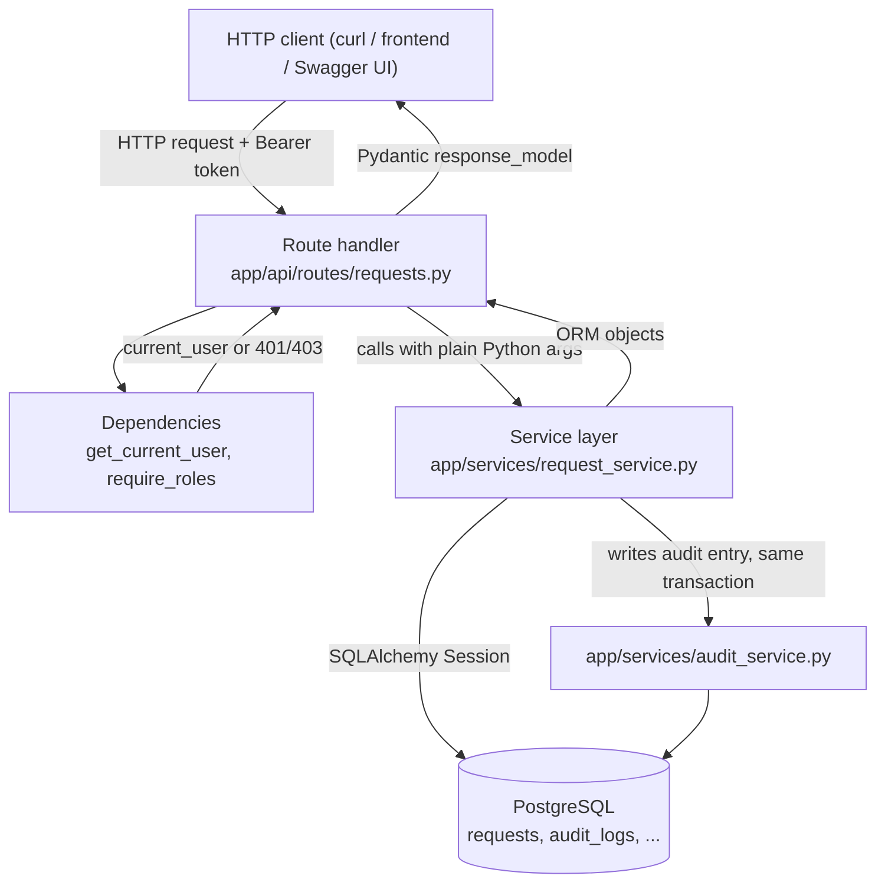

# Phase 2 — Backend + Database Engineering

## 1. What We Built

The real relational schema and CRUD API layer FlowForge runs on:

- Six new tables — `requests`, `extracted_entities`, `workflow_tasks`, `workflow_rules`, `audit_logs`, `processing_runs` — with foreign keys, indexes, and Postgres ENUM constraints, added via Alembic migration `0002` (`backend/alembic/versions/0002_create_business_tables.py`).
- A thin **service layer** (`backend/app/services/`) that owns all querying and business logic, so route handlers stay declarative.
- Full **request management API**: create, get, list (paginated/filtered/sorted), update, timeline, tasks (`backend/app/api/routes/requests.py`).
- Admin-only **workflow rule CRUD** (`backend/app/api/routes/rules.py`) — rules are stored as data, not hardcoded Python logic.
- **Role-based authorization**: a `require_roles` dependency factory (`backend/app/api/deps.py`) plus per-request ownership checks.
- 23 new pytest tests covering CRUD, pagination, filtering, sorting, and permission boundaries — 37 total, all passing, verified against both SQLite (fast unit tests) and a real containerized Postgres (via `docker compose`, with real ENUM columns and FK constraints).

Still not built: anything that actually *populates* `category`, `priority`, `extracted_entities`, `workflow_tasks`, or evaluates a `workflow_rule`. That requires the AI pipeline (Phase 4) and rule engine (Phase 5). Phase 2 builds the shape data lives in; later phases make the data move.

## 2. Why This Phase Exists

Phase 1 proved the wiring works with one table (`users`). Phase 2 answers a harder question: how do you model a business domain with multiple related entities, evolve that schema safely over time, and expose it through an API that scales past "return everything" — while making sure a `USER` can't read someone else's data just by guessing a UUID? That's the actual day-to-day work of backend engineering, and it's what the rest of FlowForge (AI results, rule evaluations, audit trails) gets persisted into.

## 3. Prerequisites

Phase 1 concepts (FastAPI, SQLAlchemy sessions, Alembic basics, JWT) are assumed. This phase goes deeper into relational modeling, migrations that evolve an existing schema, and authorization patterns.

## 4. Core Concepts

### Relational modeling and foreign keys

A `Request` doesn't exist in isolation — it belongs to a `User` (`requester_id`), and other tables belong to *it*: `extracted_entities`, `workflow_tasks`, `audit_logs`, `processing_runs` all have a `request_id` foreign key. A foreign key is a database-enforced promise: Postgres physically will not let you insert an `audit_logs` row whose `request_id` doesn't match a real row in `requests`. This is stronger than "the application code always checks first" — it's a guarantee that survives bugs, race conditions, and code you haven't written yet. See `backend/app/models/audit_log.py`'s `request_id` column and the corresponding `ForeignKey("requests.id", ondelete="CASCADE")`.

`ondelete="CASCADE"` means: if a `requests` row is ever deleted, Postgres automatically deletes its dependent `extracted_entities`/`workflow_tasks`/`audit_logs`/`processing_runs` rows too, rather than leaving orphaned rows or raising an error. FlowForge has no delete-request endpoint today, so this is mostly a documented intent for if one is added later — deleting a request should take its history with it, not leave dangling data.

### SQLAlchemy relationships (the ORM-level convenience on top of FKs)

A foreign key column is what the *database* understands. A `relationship()` (e.g. `Request.extracted_entities` in `backend/app/models/request.py`) is what lets *Python code* write `request.extracted_entities` and get a list of `ExtractedEntity` objects, without hand-writing the join. These are declared with string class names (`relationship("ExtractedEntity", ...)`) rather than importing the class directly, to avoid circular imports between model files that reference each other. That has one real consequence worth understanding: SQLAlchemy only resolves those string names when it "configures" its mapper registry, which requires every model class to have been *imported* somewhere first — see the debugging story in section 12.

### Indexes

An index lets Postgres find matching rows without scanning the whole table — the same reason a book has an index instead of requiring you to read every page. `backend/app/models/request.py`'s `__table_args__` adds indexes on `status`, `category`, and `created_at` because those are exactly the columns the `GET /api/requests` endpoint filters and sorts by (see `backend/app/services/request_service.py`). An index you never query by is pure overhead (slower writes, more disk); an index on a column you filter by turns a table scan into a fast lookup. This is a deliberate, not automatic, decision — Alembic does not add indexes for you.

### Enums: Postgres ENUM vs. plain string

Two different choices were made deliberately here, and the difference matters:

- `RequestStatus`, `ProcessingStatus`, `RequestCategory`, `RequestPriority`, `TaskStatus` are real **Postgres ENUM types** (see the `postgresql.ENUM(...)` calls in `backend/alembic/versions/0002_create_business_tables.py`). These are closed, small, stable sets defined by the spec — the database itself rejects any value outside the set.
- `AuditLog.event_type` and `ProcessingRun.stage` are plain `VARCHAR` columns, even though the code uses consistent string values like `"REQUEST_CREATED"`. Why: every remaining phase adds new event types (`AI_CLASSIFICATION_COMPLETED`, `RULE_TRIGGERED`, `TASK_CREATED`, ...). A Postgres ENUM requires a migration (`ALTER TYPE ... ADD VALUE`) every single time you add one value. For a set that grows every phase, that migration tax isn't worth the extra type-safety — see the code comment directly above `event_type` in `backend/app/models/audit_log.py`.

### Pydantic schemas as the request/response contract

Every route has a matching schema in `backend/app/schemas/`: `RequestCreate` (what a client may send to create one), `RequestRead` (what the API returns), `RequestUpdate` (what a client may send to patch one — every field optional, so a client can update just `title` without resending everything). These aren't the same as the SQLAlchemy models — `RequestRead` deliberately never includes `password_hash`-equivalent internals, and `RequestCreate` deliberately can't set `status` or `id` (a client can't invent their own request ID or skip straight to `COMPLETED`). Keeping these separate is what makes over-posting attacks (a client sneaking extra fields into a request body) structurally impossible rather than something you have to remember to filter out.

### The service layer

Compare `backend/app/api/routes/requests.py::create_request` (the route) to `backend/app/services/request_service.py::create_request` (the service function it calls). The route's job is entirely HTTP concerns: parse the request, resolve `current_user` from the token, call the service, shape the response. The service's job is entirely business logic: build the `Request` row, write the `REQUEST_CREATED` audit log, commit. This split means the business logic (e.g., "creating a request always writes an audit log") is testable and reusable without spinning up an HTTP request — and later, when Phase 3's Celery worker also needs to update requests, it can call the same service functions instead of duplicating logic.

We did **not** build a full repository-pattern class hierarchy (a `RequestRepository` interface, etc.) on top of this. The service functions take a `Session` directly. For an app this size, a repository abstraction over SQLAlchemy — which is already an abstraction over SQL — would be an extra layer with no real payoff (see section 11).

### Pagination, filtering, and sorting — server-side

`GET /api/requests` never returns "everything." `backend/app/schemas/pagination.py::Page` is a generic envelope (`items`, `total`, `page`, `page_size`, `pages`). `backend/app/services/request_service.py::list_requests` builds one SQLAlchemy `Select` query, applies `.where(...)` clauses only for filters actually provided, gets a `total` via a `SELECT COUNT(*)` **subquery** (not by fetching every row into Python and calling `len()` — see the comment in that function), then applies `.order_by().offset().limit()` for the actual page of data. Two round trips to the database (count + page), zero over-fetching, regardless of whether the table has 10 rows or 10 million.

### Authorization: two different mechanisms

1. **Role-based** (`backend/app/api/deps.py::require_roles`): a dependency factory — `require_roles(UserRole.ADMIN)` returns a dependency that 403s unless `current_user.role` is in the allowed set. Used wholesale on every `/api/rules` route.
2. **Ownership-based** (`backend/app/api/routes/requests.py::_ensure_can_view`): a `USER` can only see *their own* requests — not decided by role alone, but by comparing `request.requester_id` to `current_user.id`. Note it raises `404`, not `403`, for a non-owner — deliberately, to avoid confirming that a given request ID exists to someone who isn't allowed to know that (an IDOR — insecure direct object reference — mitigation).

`GET /api/requests` combines both: `requester_id = None if current_user.role in STAFF_ROLES else current_user.id` — if you're staff, no filter is applied (see everything); if you're a regular user, the filter is forced to your own ID server-side, regardless of anything the client sends. A malicious client cannot bypass this by manipulating query parameters, because there is no query parameter for "whose requests to show" — it's derived from the token, not from client input.

## 5. Mental Model

Every write to a `Request` now has a shadow: an `AuditLog` row. Nothing updates `requests` silently. `request_service.create_request` and `request_service.update_request` both call `audit_service.record_event` in the same transaction (before `db.commit()`), which means the audit trail and the actual state change either both happen or neither does — there's no window where a request changed but the log didn't get written, because they're the same database transaction, not two separate operations.

## 6. Architecture Diagram

## 7. Request/Data Flow

Trace of "a USER creates a request, then an ADMIN marks it COMPLETED":

1. **`POST /api/requests`** with `{title, description, department}` and a USER's bearer token.
   - FastAPI validates the body against `RequestCreate` (`backend/app/schemas/request.py`) — missing/too-short fields never reach application code, they get `422`.
   - `get_current_user` (`backend/app/api/deps.py`) resolves the token to a `User` row.
   - `create_request` route (`backend/app/api/routes/requests.py`) calls `request_service.create_request`.
   - The service builds a `Request(status=PENDING, processing_status=QUEUED)`, `db.add`, `db.flush()` (assigns the ID without committing yet), then calls `audit_service.record_event(event_type="REQUEST_CREATED", ...)`, then `db.commit()`.
   - Response: `RequestRead` — `201 Created`.

2. **`GET /api/requests/{id}/timeline`** as the same USER — returns the one `REQUEST_CREATED` audit row, ordered chronologically. *Can fail*: wrong request ID → `404` from `_get_request_or_404`.

3. **`PATCH /api/requests/{id}` with `{"status": "COMPLETED"}`** as an ADMIN token.
   - `_ensure_can_view` passes (ADMIN is staff, sees everything).
   - The route checks `payload.status is not None and not is_staff` — false here (admin *is* staff) — so it proceeds.
   - `request_service.update_request` diffs the incoming fields against the current row, mutates only what changed, writes a `REQUEST_UPDATED` audit entry listing exactly which fields changed, commits.
   - *Can fail*: a non-staff token attempting this → `403` before any database write happens at all.

4. **The original USER tries `PATCH` on the same (now-`COMPLETED`) request** — the route's `is_staff` branch checks `request.status != RequestStatus.PENDING` and returns `409 Conflict`: the request has moved past the point where the requester is allowed to edit it.

## 8. Codebase Mapping

| Layer | File | Responsibility |
|---|---|---|
| Models | `backend/app/models/request.py` | `Request` + `RequestStatus`/`ProcessingStatus`/`RequestCategory`/`RequestPriority` enums |
| Models | `backend/app/models/extracted_entity.py`, `workflow_task.py`, `workflow_rule.py`, `audit_log.py`, `processing_run.py` | The remaining five tables |
| Models | `backend/app/models/__init__.py` | Central import point so every model is registered before relationships resolve |
| Schemas | `backend/app/schemas/request.py`, `rule.py`, `audit_log.py`, `workflow_task.py`, `pagination.py` | Request/response contracts |
| Services | `backend/app/services/request_service.py` | Create/list/get/update requests; pagination math |
| Services | `backend/app/services/rule_service.py` | CRUD for `WorkflowRule` |
| Services | `backend/app/services/audit_service.py` | Single place every audit log entry is written |
| Dependencies | `backend/app/api/deps.py` | `get_current_user` (Phase 1) + `require_roles` (Phase 2) |
| Routes | `backend/app/api/routes/requests.py` | All `/api/requests*` endpoints, ownership checks |
| Routes | `backend/app/api/routes/rules.py` | All `/api/rules*` endpoints, admin-only |
| Migration | `backend/alembic/versions/0002_create_business_tables.py` | Creates all six new tables, indexes, ENUM types |
| Tests | `backend/tests/test_requests.py`, `test_rules.py` | 23 new tests |
| Tests | `backend/tests/conftest.py` | Added `user_a`/`user_b`/`operator_user`/`admin_user` fixtures with pre-built auth headers |

## 9. File-by-File Walkthrough

Covered inline throughout sections 4, 7, and 8 with concrete file/function references, per the no-code-dump rule — open the files alongside this document.

## 10. Design Decisions

**Why a service layer but not a full repository pattern?** The service layer earns its keep: it's where multi-step business logic (create request → write audit log → commit, all-or-nothing) actually lives, and it's reusable from both HTTP routes and (starting Phase 3) Celery tasks. A repository class wrapping each SQLAlchemy query would add indirection without adding a real capability — `Session` already *is* the data-access abstraction; wrapping it again just to satisfy a pattern name is complexity spec explicitly warns against ("do not introduce unnecessary architectural layers").

**Why 404, not 403, for viewing someone else's request?** A 403 confirms "this resource exists, you're just not allowed to see it" — which is itself information leakage (you now know a given UUID is a real request). A 404 gives an attacker probing UUIDs nothing to distinguish "doesn't exist" from "exists but isn't yours."

**Why can OPERATOR see every request right now, not just "assigned" ones?** Because "assigned" doesn't exist yet — `workflow_tasks` has no assignee concept until Phase 5 builds task assignment. Restricting OPERATOR today would just mean building a restriction now and rebuilding it correctly in Phase 5. This is called out explicitly as a Phase 2 simplification in the code comment above `STAFF_ROLES`.

**Why is `workflow_rules.condition`/`action` a plain text column, not structured JSON or a real DSL?** Phase 2's job is *storage* for rule definitions (matches spec §17's example: `condition: "priority == HIGH"`, `action: "assign_team = IT_ESCALATION"`). Phase 5 is explicitly where "the exact implementation should be maintainable and explainable" for evaluating these — building a parser/evaluator now would be building Phase 5 early, and guessing its shape before we've designed it risks a schema that doesn't fit what the evaluator actually needs.

## 11. Trade-offs

- **`workflow_rules` has no `enabled`-aware uniqueness or conflict detection.** Two enabled rules with contradictory actions for the same condition can coexist — nothing stops an admin from creating them. Phase 5's rule engine will need an explicit, documented conflict-resolution strategy (e.g., "first matching rule wins," "most specific wins"); Phase 2 deliberately doesn't guess at it.
- **No soft-delete anywhere.** There's no `deleted_at` column and no delete endpoints. This keeps the schema simpler now, at the cost of "how do we ever remove a request" being an open question — reasonable for Phase 2, worth flagging as unresolved rather than silently deciding it via omission.
- **`PATCH /api/requests/{id}` folds two very different permissions (edit-your-own-content vs. override-status) into one endpoint,** distinguished by field presence and role. This keeps the API surface small (one PATCH route instead of two), at the cost of `update_request`'s authorization logic being slightly less obvious at a glance than if status changes were a separate endpoint. Documented here so it's not a surprise later.
- **Count queries add a second database round-trip per list request.** `list_requests` runs one `SELECT COUNT(*)` and one `SELECT ... LIMIT/OFFSET`. This is standard and correct, but it is two queries, not one — worth knowing when reasoning about request latency under load.

## 12. Failure Scenarios

| What failed | How it surfaced | Fix |
|---|---|---|
| `Request.extracted_entities`/`processing_runs` relationships referenced `"ExtractedEntity"`/`"ProcessingRun"` by string, but nothing in the app's real import path (`main.py` → routers → models) ever imported those two modules | `sqlalchemy.exc.InvalidRequestError: ... expression 'ExtractedEntity' failed to locate a name` — and only on *some* test runs, because SQLAlchemy only resolves relationship strings the first time any ORM operation needs the full mapper registry configured | Added `backend/app/models/__init__.py` that imports every model module, so importing any one model transitively registers all of them |
| A `USER` PATCHes `status` on their own request | Route explicitly checks `payload.status is not None and not is_staff` before touching the database | `403`, no database write attempted |
| A `USER` PATCHes any field after an ADMIN already marked the request `COMPLETED` | `request.status != RequestStatus.PENDING` check in the route | `409 Conflict` — the state machine, not just the field list, gates the edit |
| Filtering `GET /api/requests` by a `status` value that isn't a real enum member | FastAPI/Pydantic validates `status_filter: RequestStatus \| None` before the route body runs | `422` |

## 13. Debugging Guide

- **"My new model's relationship isn't resolving / mapper configuration error."** Check `backend/app/models/__init__.py` — is the new model module imported there? This is the #1 gotcha with string-based SQLAlchemy relationships.
- **"My migration works locally but fails in fresh Postgres."** Check whether you're relying on a Postgres ENUM type that a previous migration created — `create_type=False` on a column definition means "this type already exists, don't recreate it," which will fail if that earlier migration hasn't actually run.
- **"A list endpoint returns the wrong `total`."** Check whether a filter is applied to the `SELECT` (`query.where(...)`) but *not* reflected in the count subquery — in this codebase they share the same `query` object before pagination is applied, specifically to prevent this class of bug (see `list_requests`).
- **"403 vs 404 vs 409 — which should a new permission check return?"** 401 = not authenticated at all. 403 = authenticated, but this role can never do this. 404 = authenticated, might be allowed in general, but this specific resource isn't yours (avoid leaking existence). 409 = allowed in general, but the resource's current state conflicts with the request.

## 14. Hands-on Exercises

1. Add a `GET /api/requests/{id}` response field `owner_can_edit: bool`, computed server-side from `request.status == PENDING and request.requester_id == current_user.id` (or `is_staff`). Add a test for both true and false cases.
2. Write a new Alembic migration (`0003`) that adds a `due_date` nullable `DateTime` column to `requests`. Apply it against the Dockerized Postgres and confirm with `\d requests` in `psql`.
3. Add a `search` query parameter to `GET /api/requests` that does a case-insensitive substring match on `title` (hint: look at how `department` filtering already uses `.ilike()`). Write a test.
4. Deliberately remove `backend/app/models/__init__.py`'s import of `processing_run` and run the test suite — reproduce the mapper configuration error from section 12, then explain in your own words why it happens before restoring the fix.
5. Change `_ensure_can_view` to return `403` instead of `404` for a non-owner, and explain (in writing) the concrete information-disclosure difference an attacker gains from that change.

## 15. Interview Questions

- Walk through what happens, database-transaction-wise, when a request is created — why is the audit log write inside the same transaction as the request insert?
- Why does `list_requests` run a separate `COUNT` query instead of using `len()` on the fetched page?
- What's the actual difference between a SQLAlchemy `relationship()` and a foreign key column? Could you have one without the other?
- Why is `event_type` a string column but `status` is a Postgres ENUM — what's the deciding factor?
- If `USER` A knows `USER` B's request ID, what happens when they call `GET /api/requests/{that_id}`, and why does the code choose that specific status code?

## 16. Reverse Explanation Questions

- Explain, using the actual file and function names, everything that happens between `PATCH /api/requests/{id}` with a status change arriving and the audit log entry existing in the database.
- Explain why `workflow_rules.condition`/`action` are plain text right now instead of a structured format, and what phase changes that.
- Explain the mapper-configuration bug from section 12 in your own words, as if debugging it live with no hints.

## 17. Quiz

1. Which HTTP status code does a `USER` get when PATCHing someone else's request, and why is it not the same code a `USER` gets when PATCHing their own already-`COMPLETED` request?
2. Name the two database round-trips `list_requests` performs and why neither can be skipped.
3. True or false: `ondelete="CASCADE"` on `audit_logs.request_id` means deleting a `User` also deletes their `Request`'s audit logs.
4. Where exactly does `OPERATOR`'s "can view all requests" behavior come from in the code, and what specific future change would need to replace it?
5. What would break, concretely, if `backend/app/models/__init__.py` didn't exist?

## 18. Common Misconceptions

- **"A foreign key and a `relationship()` are the same thing."** The FK is a database-level constraint; the `relationship()` is a Python/ORM convenience for traversing it. You can have a raw FK column with zero `relationship()`s declared, and queries would still work (via manual joins) — you'd just lose the `request.extracted_entities` convenience syntax.
- **"Pagination is just for making pages look nice in the UI."** It exists primarily to stop the database and network from ever having to move an unboundedly large result set. Section 6.4 of the spec makes this explicit for the frontend; the backend decision to bound `page_size` at 100 (`Query(..., le=100)`) is the actual enforcement point — the frontend UI is a consumer of this guarantee, not the source of it.
- **"Since nothing populates `category`/`priority` yet, those columns are pointless in Phase 2."** They're not pointless — they're the *contract* Phase 4's AI pipeline will write into and Phase 2's API already knows how to filter/sort/serialize. Building the shape before the thing that fills it is the point of doing this in phases.

## 19. Phase Checklist

- [x] Full relational schema (6 new tables) created via Alembic migration, not `create_all()`
- [x] Foreign keys, indexes, and Postgres ENUM constraints verified against real Postgres (not just SQLite tests)
- [x] Service layer separates business logic from HTTP route handlers
- [x] `GET /api/requests` supports real server-side pagination, filtering (status/category/priority/department), and sorting
- [x] `USER` role is scoped to their own requests; `ADMIN`/`OPERATOR` see all — enforced server-side, not via client-trusted parameters
- [x] `workflow_rules` CRUD is ADMIN-only
- [x] Every request creation and update writes a corresponding audit log entry in the same transaction
- [x] 37 pytest tests pass (14 from Phase 1 + 23 new), plus manual end-to-end verification against the Dockerized Postgres stack

## 20. What I Should Be Able to Explain

1. Why `requests`, `audit_logs`, `workflow_tasks` etc. use real foreign keys instead of just storing a loose UUID string.
2. The full lifecycle of a `PATCH /api/requests/{id}` status change: validation → authorization → service call → audit log → commit → response.
3. Why some enums are Postgres ENUM types and others are plain strings, and how to decide which a new field should be.
4. What server-side pagination actually protects against, concretely.
5. The difference between 401/403/404/409 as used in this codebase, with a real example of each from the code.

We'll verify this together when you're ready.
