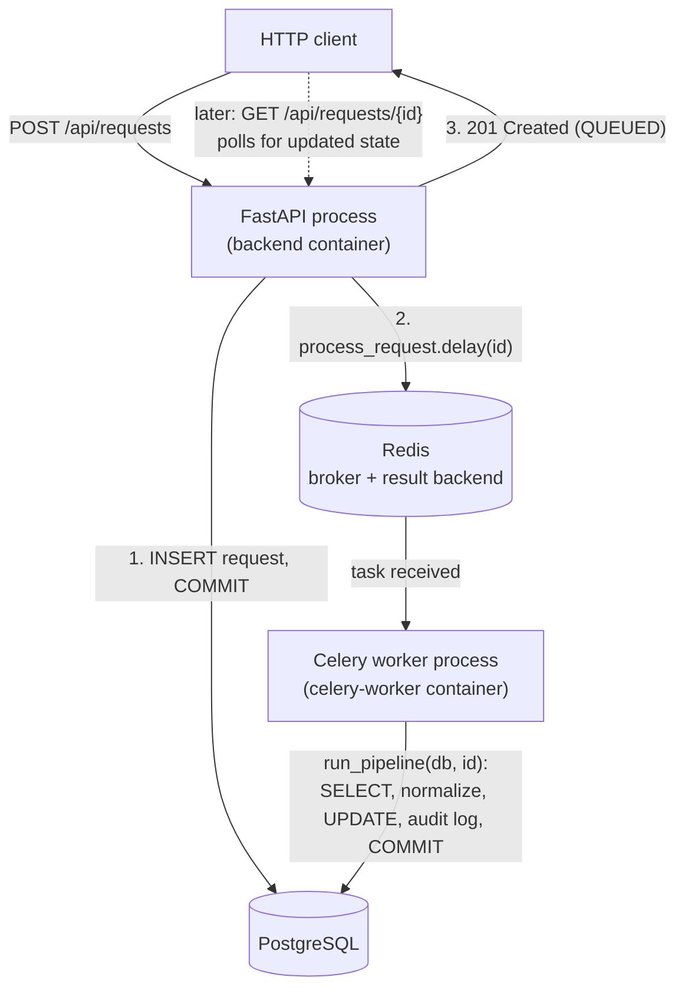

# Phase 3 — Asynchronous Processing

## 1. What We Built

The queue and worker infrastructure the rest of FlowForge's AI/business-logic pipeline runs on:

- **Redis** as the message broker (and result backend) — a new `redis` container.
- **Celery** as the task queue system — a new `celery-worker` container running `app/workers/celery_app.py`.
- A **task/logic split**: `app/workers/tasks.py::process_request` is a thin Celery-bound wrapper (owns the DB session and retry policy); `app/services/processing_service.py::run_pipeline` is the actual, plain-Python pipeline logic, independently unit-testable with zero Celery or Redis involved.
- The pipeline's one real stage today: **text normalization** — collapsing whitespace in `description` into `normalized_description`. It also drives `processing_status` through `QUEUED → IN_PROGRESS → COMPLETED` (or `FAILED`), creates a `ProcessingRun` row, and writes `PROCESSING_STARTED`/`TEXT_NORMALIZED`/`PROCESSING_COMPLETED` audit log entries.
- A genuine **retry mechanism**: Celery automatically retries on `OperationalError` (real transient DB connectivity failures) with exponential backoff; a manual `POST /api/requests/{id}/retry` endpoint (OPERATOR/ADMIN only) re-queues any request whose `processing_status` is `FAILED`.
- An **idempotency guard**: re-running the pipeline for an already-`COMPLETED` request is a safe no-op, verified by a dedicated test.
- 11 new tests (7 pipeline unit tests + 4 API tests), 48 total, all passing — verified against a real Redis+Celery+Postgres stack via `docker compose`, watching a request actually move from `QUEUED` to `COMPLETED` asynchronously, with the worker's own logs as evidence.

Still not built: anything AI-related. The pipeline has exactly the one stage that's real today; Phase 4 inserts classification/extraction between "normalize" and "complete," extending this same function rather than replacing it.

## 2. Why This Phase Exists

`POST /api/requests` in Phase 2 already returned instantly — but nothing was actually processing the request afterward. Phase 3's whole point, stated directly in the spec, is: **I should understand exactly why we do not run the AI pipeline directly inside the HTTP request.** Once Phase 4 adds a real LLM call (which can take seconds and can fail), doing that synchronously inside a request handler would mean every `POST /api/requests` blocks for however long that call takes, and one slow/down AI provider takes the entire API down with it. Phase 3 builds the escape hatch *before* there's anything slow to escape from, so Phase 4 has somewhere safe to put its AI calls.

## 3. Prerequisites

Phases 1–2 (FastAPI, SQLAlchemy sessions, the service layer pattern, audit logging) are assumed. This phase introduces message queues, background workers, and the specific distributed-systems failure modes that come with running code outside the request/response cycle.

## 4. Core Concepts

### Synchronous vs. asynchronous processing

Synchronous: the client waits while the server does everything, then gets one response. Asynchronous (as used here — not to be confused with Python's `async`/`await`, which FlowForge also uses inside FastAPI, but that's a different concept): the server does a small amount of work, hands the rest off to be done *later, by someone else*, and responds immediately. `POST /api/requests` (`backend/app/api/routes/requests.py::create_request`) is the concrete example: it inserts the row, writes the `REQUEST_CREATED` audit log, commits, calls `process_request_task.delay(...)`, and returns `201` — all before the description has even been normalized. The normalization happens moments later, in a completely separate process (the Celery worker), which the client never talks to directly.

### Message queues, producers, and workers

A queue is a to-do list one or more processes can safely share: **producers** add items, **workers** take items off and do them, and the queue itself (Redis, here) is the thing making sure two workers don't grab the same item. FastAPI is the producer — `process_request_task.delay(str(request.id))` doesn't run any pipeline code itself; it serializes `{"task": "process_request", "args": [request_id]}` and pushes it onto a Redis list. The `celery-worker` container is the consumer — it's a long-running process (started with `celery -A app.workers.celery_app worker`, see `docker-compose.yml`) that blocks waiting for new items and executes them as they arrive. Producer and worker never call each other directly; they only ever talk to Redis. This is why they can be scaled independently (more worker containers = more parallel processing, without touching the API at all) and why one being down doesn't crash the other (a task just waits in the queue until a worker is available).

### Celery, specifically

Celery is the Python library that implements "task queue" on top of a broker like Redis. `backend/app/workers/celery_app.py` creates one `Celery` app instance, configured with `broker=... , backend=...` (the backend is where task *results* — success/failure/return value — get stored; FlowForge doesn't currently read results back, since progress is tracked via `processing_status`/`audit_logs` in Postgres instead, but the backend is configured for completeness and future use). `backend/app/workers/tasks.py::process_request` is decorated `@celery_app.task(...)` — that decorator is what turns a plain Python function into something `.delay()`-able.

### Task lifecycle

A task's life: **queued** (sitting in Redis, not yet picked up) → **received** (a worker process has taken it off the queue — you can see this exact line, `Task process_request[...] received`, in `docker compose logs celery-worker`) → **started** (worker begins executing the function body) → **succeeded** or **failed** (with retries possibly happening in between — see below). None of these states are visible to the HTTP client that originally created the request; they're only visible via the worker's logs and via what the task's own code chooses to persist (here: `processing_status` and `audit_logs`, both in Postgres, both queryable through the normal REST API).

### Retries and retry limits

Two completely different kinds of "this failed" exist in `run_pipeline` (`backend/app/services/processing_service.py`), and they're handled differently on purpose:

- **Transient infrastructure failure** (Postgres briefly unreachable → `sqlalchemy.exc.OperationalError`): this is exactly the kind of failure that *might* succeed if you just try again in a few seconds. `backend/app/workers/tasks.py`'s `@celery_app.task(autoretry_for=(OperationalError,), retry_backoff=True, retry_backoff_max=60, max_retries=3)` tells Celery: if this specific exception escapes the task, automatically re-queue it, waiting longer between each attempt (backoff), up to 3 attempts, then give up.
- **A real processing failure** (something about *this specific request* is broken, not the infrastructure): caught inside `run_pipeline` itself, which writes a `PROCESSING_FAILED` audit log, sets `processing_status = FAILED`, and re-raises. Retrying this automatically wouldn't help — the same input would fail the same way again. This is what the manual `/retry` endpoint exists for: a human (OPERATOR/ADMIN) decides to try again, possibly after investigating or fixing something.

### Idempotency

A retry — automatic or manual — means the *same* task can run more than once for the *same* request. If `run_pipeline` naively re-did all its work every time, a request retried twice would end up with two `PROCESSING_STARTED` audit logs, two `ProcessingRun` rows, etc. — a misleading history that doesn't reflect what actually happened. The fix is the very first check in `run_pipeline`: `if request.processing_status == ProcessingStatus.COMPLETED: return`. An operation is **idempotent** if running it multiple times has the same effect as running it once — this early-return is exactly what makes `run_pipeline` idempotent with respect to already-completed requests. `test_run_pipeline_is_idempotent` (`backend/tests/test_processing_service.py`) proves this directly: calling `run_pipeline` twice in a row still leaves exactly one `ProcessingRun` and exactly three audit log entries, not six.

### Eventual completion

There's no guarantee a request is processed the instant it's created — only that, barring a permanent failure, it *will* be processed. This is the trade-off asynchronous processing makes: you give up "instant, guaranteed-by-the-time-the-response-returns" completion in exchange for the API never blocking on slow work. The client's job (and the frontend's job, come Phase 6) is to poll or otherwise check back — `GET /api/requests/{id}` — rather than assume the state returned from `POST /api/requests` is final.

### Monitoring worker activity

`docker compose logs celery-worker` is the direct window into what the worker is doing right now — every `Task process_request[...] received`/`succeeded`/`failed` line comes from Celery itself, and the `celery_task_started`/`celery_task_finished` lines (with `request_id` and retry attempt number) come from FlowForge's own logging in `tasks.py`. The `celery-worker` service's Docker healthcheck (`docker-compose.yml`) runs `celery -A app.workers.celery_app inspect ping` — a real command that asks a live worker process to respond over the broker, not a fake stand-in health check. If the worker process has crashed or can't reach Redis, this genuinely fails and Docker marks the container unhealthy.

## 5. Mental Model

There are now two independent "things reading and writing the `requests` table": the FastAPI process (handling HTTP requests) and the Celery worker process (handling background tasks). They never call each other's code directly and never share Python memory — the *only* things connecting them are Redis (for handing off "please process request X") and Postgres (for the actual data both of them read and write). This is why `process_request_task.delay(...)` is called only *after* `db.commit()` in the route handler: the worker, running in a completely different process (possibly on a different machine, in a real deployment), can only see what's actually been committed to Postgres — not anything still sitting in an uncommitted transaction in the API process's memory.

## 6. Architecture Diagram

## 7. Request/Data Flow

Trace of "create a request, watch it get processed" — the exact sequence verified live against the Dockerized stack:

1. **`POST /api/requests`** — `create_request` (`backend/app/api/routes/requests.py`) calls `request_service.create_request` (commits the row + `REQUEST_CREATED` audit log), then `process_request_task.delay(str(request.id))`, then returns immediately. Verified: the response body showed `processing_status: "QUEUED"` and `normalized_description: null` — proof nothing beyond the insert had happened yet.

2. **Redis** now holds one message: `{"task": "process_request", "args": ["<request-id>"]}`.

3. **The Celery worker**, already running and blocked waiting on Redis, receives it — `docker compose logs celery-worker` showed `Task process_request[...] received` within milliseconds.

4. **`process_request` (`backend/app/workers/tasks.py`)** opens a fresh `SessionLocal()` (its *own* DB session — completely separate from any session the API process used) and calls `processing_service.run_pipeline(db, request_id)`.

5. **`run_pipeline`** (`backend/app/services/processing_service.py`): loads the `Request`, checks the idempotency guard (not completed, so proceeds), creates a `ProcessingRun(stage="NORMALIZE", status=STARTED)`, sets `processing_status = IN_PROGRESS`, writes `PROCESSING_STARTED`, commits — then normalizes the description, sets `processing_status = COMPLETED`, marks the `ProcessingRun` `SUCCEEDED`, writes `TEXT_NORMALIZED` and `PROCESSING_COMPLETED`, commits again.

6. **The worker closes its DB session** (`finally: db.close()` in `tasks.py`) and logs `celery_task_finished`.

7. **The client (or anyone) calls `GET /api/requests/{id}` later** — sees `processing_status: "COMPLETED"` and the populated `normalized_description`, entirely independent of the original `POST` request/response cycle, which had already finished long before step 4 even started.

*Can fail at step 4*: Postgres briefly unreachable → `OperationalError` propagates out of `run_pipeline` uncaught (it's deliberately not swallowed by the generic `except Exception` — see the code comment in `processing_service.py`) → Celery's `autoretry_for` catches it at the task level → task re-queued with backoff → retried, up to 3 times, by (possibly) the same worker process later.

## 8. Codebase Mapping

| Layer | File | Responsibility |
|---|---|---|
| Celery app | `backend/app/workers/celery_app.py` | Configures the Celery instance (broker/backend URLs, serialization, prefetch) |
| Task wrapper | `backend/app/workers/tasks.py` | `process_request` — DB session lifecycle, retry policy; delegates to the service layer |
| Pipeline logic | `backend/app/services/processing_service.py` | `normalize_text`, `run_pipeline` — the actual, independently testable business logic |
| Route (producer) | `backend/app/api/routes/requests.py` | Enqueues the task after commit (`create_request`); manual `retry_request` endpoint |
| Model | `backend/app/models/request.py` | Adds `normalized_description` |
| Migration | `backend/alembic/versions/0003_add_normalized_description.py` | Adds that column |
| Config | `backend/app/core/config.py` | `CELERY_BROKER_URL`, `CELERY_RESULT_BACKEND` |
| Orchestration | `docker-compose.yml` | New `redis` and `celery-worker` services, real Celery-based healthcheck |
| Tests | `backend/tests/test_processing_service.py` | Pipeline logic, tested directly, no Celery/Redis involved |
| Tests | `backend/tests/test_requests.py` | New: `retry` endpoint authorization/state tests |
| Tests | `backend/tests/conftest.py` | `client` fixture now mocks `process_request.delay` |

## 9. File-by-File Walkthrough

Covered inline in sections 4 and 7 with concrete references, per the no-code-dump convention.

## 10. Design Decisions

**Why separate `tasks.py` from `processing_service.py` instead of putting everything in the `@celery_app.task`-decorated function?** Testability, directly. `test_processing_service.py`'s 7 tests call `run_pipeline(db_session, request.id)` as a plain function against an in-memory SQLite session — no Celery worker, no Redis, no network. If the pipeline logic lived inside the task function, testing it would require either running a real Celery worker in the test suite (slow, flaky) or using Celery's `task_always_eager` mode (which has its own subtleties around session/connection reuse across what's supposed to be separate processes). Keeping the split means the *business logic* is tested with the same fast, simple pattern as Phase 2's services, and only the thin wrapper (session lifecycle, retry decorator) is Celery-specific.

**Why does `create_request` enqueue the task itself, rather than `request_service.create_request` doing it?** The service layer (Phase 2's design decision, reaffirmed here) stays pure database logic — no external side effects, fully testable without mocking anything. Enqueueing a task is an infrastructure concern, not a business-logic concern, so it belongs in the route, right after the service call returns a successfully committed row.

**Why `autoretry_for=(OperationalError,)` and not a bare `except Exception: retry`?** Retrying blindly on *any* failure would also retry on bugs, bad input, and permanent failures — masking real problems behind an illusion of "it'll succeed eventually" and wasting worker time on something that will never succeed. Retrying is only correct for failures that are plausibly transient; `OperationalError` (connection dropped, connection refused, etc.) is the textbook example of one.

**Why is the manual `/retry` endpoint restricted to `processing_status == FAILED`, not any status?** Retrying a `COMPLETED` request would silently re-run the pipeline and (once Phase 4 adds AI calls) waste a real API call for no reason, plus risk the idempotency guard hiding the fact that nothing actually happened. Restricting retry to genuinely failed requests keeps the endpoint's meaning unambiguous: "try again, because it didn't work."

## 11. Trade-offs

- **No dead-letter queue.** After 3 failed retries, a task is simply gone — Celery doesn't re-queue it again, and nothing automatically surfaces "this task exhausted its retries" beyond whatever `processing_status`/`audit_logs` show. A production system typically routes exhausted tasks somewhere a human will actually see them (an alert, a dedicated failed-tasks table/queue). Not built here — flagged as a real gap, not silently ignored.
- **The Celery result backend (Redis) is configured but unused.** FlowForge tracks task progress via `processing_status` in Postgres instead of Celery's built-in result storage, because that state needs to be queryable through the normal REST API anyway (a frontend polling `GET /api/requests/{id}` shouldn't need to know anything about Celery). The result backend costs nothing to leave configured, but it's genuinely redundant with what Postgres already tracks — worth knowing so you don't go looking for meaningful data there.
- **`worker_prefetch_multiplier=1`** means each worker process only ever holds one task at a time from the queue. This is the right call once Phase 4 adds a real (possibly slow) AI call per task — you don't want one worker hoarding 16 tasks while a second worker sits idle. The cost: slightly less throughput for today's near-instant normalization-only tasks, where prefetching more would have been harmless. Configured for where this is going, not just for where it is today.
- **Tests mock `.delay()` entirely rather than using `task_always_eager`.** This means `POST /api/requests` tests never actually exercise the real Celery task-dispatch code path — only that `.delay` gets called (implicitly, by not erroring). The pipeline logic itself is fully tested (`test_processing_service.py`), just not through the Celery entry point. A more thorough (and more complex) test setup would also exercise `tasks.py::process_request` directly.

## 12. Failure Scenarios

| What failed | How the system detects it | How it recovers | What's logged | What the caller sees |
|---|---|---|---|---|
| Postgres briefly unreachable during `run_pipeline` | `OperationalError` raised by SQLAlchemy | `autoretry_for` re-queues with exponential backoff, up to 3 attempts | Celery logs the retry attempt; worker's own logs show `attempt=2`, `attempt=3` | `processing_status` stays `IN_PROGRESS` (or whatever it was) until a retry succeeds or all retries are exhausted — `GET /api/requests/{id}` reflects this honestly, no fake "done" |
| Redis (the broker) is down when `create_request` calls `.delay()` | Celery raises a connection error | **Not currently handled** — this would surface as a `500` on `POST /api/requests`, since `.delay()` is called synchronously in the route before responding | Uncaught exception, FastAPI's default error handler logs it | Generic `500` — a real gap; a more resilient design would let the request be created and queue the task in a retry-safe outbox pattern, deferred as a known limitation |
| Celery worker container crashes mid-task | The message was already marked "received" but never acknowledged — Redis/Celery's visibility timeout eventually makes it available again for another worker | A future worker picks it up and reruns `run_pipeline` from scratch | Nothing logs the crash itself (that's the worker process dying), but the eventual re-run logs normally | `processing_status` may sit at `IN_PROGRESS` longer than expected, then complete once redelivered — this is exactly the redelivery scenario the idempotency guard exists for |
| A request is retried while genuinely already `COMPLETED` (e.g. two redeliveries race) | `run_pipeline`'s idempotency check | Second run is a no-op, returns immediately | `logger.info("processing_pipeline already_completed ...")` | No visible difference — the correct, final state, without duplicate audit history |

## 13. Debugging Guide

1. **"My request is stuck at `QUEUED` forever."** Check `docker compose ps` — is `celery-worker` running and healthy? Check `docker compose logs celery-worker` — was the task ever `received`? If not, check `docker compose logs redis` and confirm `CELERY_BROKER_URL` matches what both the backend and worker containers are configured with.
2. **"My request is stuck at `IN_PROGRESS`."** The worker started but never finished — check `docker compose logs celery-worker` for an exception traceback right after the `celery_task_started` line for that request ID.
3. **"I don't see my new audit log event."** Check whether the code path that should log it is actually being reached — add a temporary log line, or check `processing_status`/`status` first to infer which branch executed.
4. **"Retries aren't happening."** Confirm the exception being raised is actually `sqlalchemy.exc.OperationalError` and not some other exception type — `autoretry_for` only catches exactly what's listed.
5. **General worker health**: `docker compose exec celery-worker celery -A app.workers.celery_app inspect ping` (the same command the Docker healthcheck runs) — a quick manual check that the worker process is alive and can reach the broker.

## 14. Hands-on Exercises

1. Stop the `celery-worker` container (`docker compose stop celery-worker`) after creating a request, confirm it sits at `QUEUED`, then start it again and watch it complete — describe what you observed and why nothing was lost.
2. Add a second, deliberately-idempotency-testing stage: extend `run_pipeline` with a step that counts words in `normalized_description` and stores it somewhere (you'll need a new column + migration). Make sure calling `run_pipeline` twice still behaves correctly.
3. Change `max_retries` to `0` and, using a debugger or temporary log line, prove to yourself that a simulated `OperationalError` now fails immediately with no retry.
4. Trigger the "Redis down when creating a request" failure scenario from section 12 for real (`docker compose stop redis`, then `POST /api/requests`) — confirm the `500`, then explain (in writing) what a more resilient design would need to do differently.
5. Scale the worker: `docker compose up -d --scale celery-worker=3`, create several requests in quick succession, and use the logs to confirm different worker processes picked up different tasks.

## 15. Interview Questions

- Why not just run the AI classification (Phase 4) synchronously inside `POST /api/requests`? What specifically breaks if you do?
- What's the actual difference between Celery's automatic retry and the manual `/retry` endpoint — when is each the right tool?
- Explain idempotency in your own words, then point to the exact line of code that makes `run_pipeline` idempotent.
- What happens if the Celery worker container crashes in the middle of processing a request? Walk through exactly what state the request ends up in and how it recovers.
- Why is the task enqueued *after* the database commit, not before or as part of the same transaction?

## 16. Reverse Explanation Questions

- Explain, using the actual file and function names, everything that happens between `process_request_task.delay(...)` being called and `PROCESSING_COMPLETED` appearing in the audit log.
- Explain why `OperationalError` is handled differently from every other exception inside `run_pipeline`.
- Explain what "eventual completion" means for this system and why the frontend (Phase 6) will need to account for it.

## 17. Quiz

1. Which two processes both read and write the `requests` table, and what's the only thing connecting them?
2. What specific exception type triggers Celery's automatic retry here, and why that one specifically?
3. True or false: `process_request.delay(...)` runs the pipeline immediately, in the same process, before the API responds.
4. What would happen (concretely, in terms of audit log rows) if the idempotency guard were removed and a task got redelivered twice?
5. Name the one real failure mode identified in section 12 that this phase does *not* yet handle gracefully.

## 18. Common Misconceptions

- **"Async processing means the request completes faster."** It means the *HTTP response* returns faster. The actual work (normalization now, AI classification later) still has to happen somewhere — it just happens after the response, not before it.
- **"Celery retries fix all failures automatically."** Only failures explicitly listed in `autoretry_for` get automatic retries — and only up to `max_retries`. A bug in your code, or a permanently invalid input, will retry the same number of times and then land in `FAILED` just the same as if retries didn't exist.
- **"The worker and the API share the same database session/connection."** They don't, ever. Each opens its own `SessionLocal()`, in its own process, each responsible for its own commits — this is exactly why the task is only enqueued *after* the API's commit, not before.

## 19. Phase Checklist

- [x] Redis and Celery running as their own Docker services, with a genuine (not inherited-and-wrong) healthcheck for the worker
- [x] `POST /api/requests` returns before any pipeline work happens — verified by inspecting the immediate response body
- [x] The pipeline (`run_pipeline`) is unit-testable without Celery or Redis running
- [x] A real retry mechanism exists for transient failures (`autoretry_for`) and a separate manual path exists for operator-triggered retries
- [x] The pipeline is provably idempotent (dedicated test, not just an assumption)
- [x] Every pipeline state transition writes an audit log entry, matching the same transactional pattern as Phase 2
- [x] 48 tests passing; verified end-to-end against the real Dockerized Redis+Celery+Postgres stack, including watching the worker's own logs process a real task

## 20. What I Should Be Able to Explain

1. Why running the AI pipeline inside the HTTP request handler would be a mistake, concretely.
2. The full task lifecycle: queued → received → started → succeeded/failed/retried, and where each is visible.
3. The difference between a transient failure (retried automatically) and a permanent one (requires the manual `/retry` endpoint), with real examples of each from this codebase.
4. What idempotency means and how `run_pipeline` achieves it.
5. Why the task/logic split (`tasks.py` vs. `processing_service.py`) exists, in terms of what it makes possible.

We'll verify this together when you're ready.
