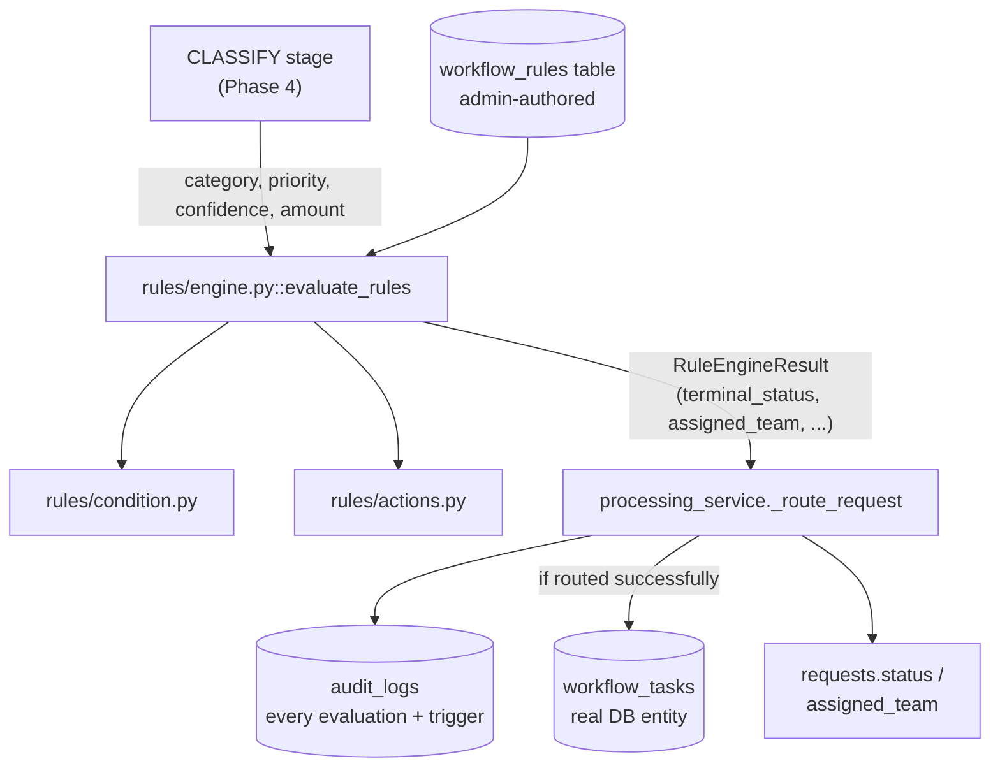

# Phase 5 — Business Automation

## 1. What We Built

The step that makes FlowForge's central promise real: **the AI never decides anything by itself.**

- A **deterministic rule engine** (`backend/app/rules/`) — a safe, restricted condition/action parser (no `eval()`, no dynamic code execution) that evaluates admin-defined `workflow_rules` against a classified request.
- A third pipeline stage, **ROUTE** (`processing_service.py`), that runs after CLASSIFY: evaluates every enabled rule, resolves conflicts with a documented, deterministic precedence policy, and either routes the request to a team (creating a real `WorkflowTask`) or sends it to `NEEDS_INFORMATION`/`MANUAL_REVIEW` — never silently leaving it unrouted.
- A new field, `requests.amount`, and AI extraction for it — needed to make the spec's own example rule (`FINANCE AND amount > 100000 → manager approval`) actually functional rather than aspirational.
- Full **explainability**: every rule evaluated (triggered or not) and every rule that fired is written to the audit trail, so "why was this request routed here" always has a concrete, queryable answer — directly satisfying the exact question list in `FLOWFORGE_SPEC.md` §8.
- A **seed script** (`backend/app/seed.py`) — the workflow rules from the spec's own examples, five demo accounts, and 18 sample requests, verified from a **completely clean database** to reach every processing outcome (routed, manual review, needs information, unprocessed).
- **A real bug found and fixed by this session's own live testing**: Postgres's `now()` returns the transaction's *start* time, not per-statement time — several audit events written in the same commit were getting identical timestamps, making their order undefined. Fixed by generating timestamps in application code. See section 12 for the full story — this is exactly why live verification against a real database matters, not just unit tests against SQLite.
- **43 new tests**, 110 total, all passing.

## 2. Why This Phase Exists

This is the spec's single most emphasized architectural principle, stated multiple times in different words: *"AI should assist decision-making, but deterministic business logic should control important business actions,"* *"Do NOT allow the LLM to make the final business decision,"* *"The system must clearly distinguish: AI DECISION → BUSINESS RULE → AUTOMATED ACTION."* Phase 4 gave FlowForge a classification. This phase is what makes that classification *safe to act on* — by putting a deterministic, auditable, admin-controlled decision layer between "the AI said X" and "the system did Y."

## 3. Prerequisites

Phases 1–4 are assumed, especially Phase 2's `workflow_rules`/`workflow_tasks`/`audit_logs` schema (built then, used for real now) and Phase 4's `AIClassificationResult` (the input this phase's rules evaluate).

## 4. Core Concepts

### Deterministic rule engines

"Deterministic" here means one specific thing: given the same request data and the same set of enabled rules, the routing decision is always exactly the same — no randomness, no model sampling, no "it depends." `backend/app/rules/condition.py` and `actions.py` implement a small, intentionally restricted language (comparisons joined by `AND`, single `key = value` actions) rather than a general-purpose scripting language — restricted specifically so every rule's effect is obvious just from reading it, and so `eval()` (a real code-injection risk for admin-editable text) is never needed. `evaluate_condition` and `parse_action` are pure functions: text and data in, a boolean or a parsed action out, no side effects, no network calls, no AI involved at all.

### Workflow states

`RequestStatus` (defined since Phase 2, mostly unused until now) gets its full meaning in this phase:

- `PENDING` — just created, pipeline hasn't routed it yet.
- `PROCESSING` — successfully routed to a team; **this does not mean the underlying issue is resolved** — it means FlowForge's automated triage finished and handed the request to a team. This distinction matters enough that it's worth restating: `processing_status = COMPLETED` (the pipeline ran) and `status = PROCESSING` (the business problem is still open, now with an owner) are two different axes, not synonyms.
- `NEEDS_INFORMATION` — the rule engine determined it can't route confidently because required data is missing (e.g. a FINANCE request with no amount).
- `MANUAL_REVIEW` — either a rule explicitly said so (low confidence) or no rule matched at all.
- `COMPLETED` — the *business* task is actually done. Nothing in this phase sets this automatically; it's set by a human via the existing Phase 2 `PATCH /api/requests/{id}` endpoint, once the assigned team has actually resolved the underlying request.

### Routing and task creation

`_route_request` (`backend/app/services/processing_service.py`) is where a routing decision becomes a real, persisted action: `request.assigned_team` is set, `request.status` moves to `PROCESSING`, and a `WorkflowTask` row is created — a genuine database entity an operator can later see and update (`GET /api/requests/{id}/tasks`, from Phase 2), not a fake external integration. The spec is explicit about this: *"Use simulated internal actions rather than fake external integrations."* `task_type` is a plain descriptive label derived from category (`_TASK_TYPE_BY_CATEGORY`) — purely for display/grouping, not a routing decision in itself.

### State transitions, and specifically the conflict-resolution policy

Multiple rules can trigger for the same request. `RuleEngineResult` (`backend/app/rules/engine.py`) resolves this with an explicit, documented policy rather than leaving it to whichever rule happened to run last:

1. **Terminal status actions always win over team assignment**, regardless of evaluation order. If any triggered rule sets `status = NEEDS_INFORMATION` or `status = MANUAL_REVIEW`, routing to a team is skipped entirely — even if another rule already matched a team.
2. **Between terminal statuses, `NEEDS_INFORMATION` outranks `MANUAL_REVIEW`.** The reasoning: if required data is missing, you can't even meaningfully assess whether the classification you'd otherwise send to manual review is trustworthy — the missing-data problem is more fundamental.
3. **For non-terminal actions with the same key** (e.g. two rules both setting `assign_team`), the **last-evaluated rule wins** — rules are evaluated in `created_at` order, so a more recently added override rule beats an older default rule for the same category.

This exact policy was verified live in this session: a seeded request matched three rules simultaneously (`Default General Routing` → assign a team, `Low Confidence Manual Review` → terminal status, `High Priority Urgent Handling` → mark urgent) — and correctly ended up in `MANUAL_REVIEW` with no task created, exactly per rule 1 above, visible directly in the audit timeline (section 7).

### Explainability

`FLOWFORGE_SPEC.md` §8 lists exactly what the system must be able to answer for any request: what AI predicted, what rule was evaluated, which triggered, why it was routed, what action was generated, when each step happened. Every one of these is answered by a combination of `AI_CLASSIFICATION_COMPLETED`'s metadata (category/priority/confidence), the single `RULE_EVALUATION_COMPLETED` audit entry (a JSON list of *every* rule checked, triggered or not, with its condition and any error), one `RULE_TRIGGERED` entry per rule that actually fired, and `REQUEST_ROUTED`/`TASK_CREATED` — all timestamped, all queryable via the existing `GET /api/requests/{id}/timeline` endpoint from Phase 2. Nothing about "why did this happen" requires reading application logs or guessing.

### AI decision vs. business rule — where exactly the line is drawn

The AI (Phase 4) produces `category`, `priority`, `confidence`, `amount`, `entities` — data. It never touches `request.status`, never assigns a team, never creates a task. Every one of those actions happens exclusively inside `_route_request`, driven entirely by `evaluate_rules`'s output, which is driven entirely by admin-authored `workflow_rules` rows. If you deleted the entire AI layer and replaced `ai_provider.classify(...)` with a function that returns fixed, hardcoded values, the routing logic would behave identically — that substitutability is the concrete proof that the AI's role is advisory input, not decision-maker.

### Workflow failure modes

A malformed rule (bad condition/action text) doesn't crash the engine or lose the request — `evaluate_rules` catches `RuleParseError` per-rule, records the error in that rule's evaluation entry, and continues evaluating the remaining rules (`test_malformed_rule_is_skipped_not_crashed` proves this directly). If literally no rule matches anything (e.g. every rule for a category gets disabled), the fallback is `MANUAL_REVIEW` with an explicit `MANUAL_REVIEW_REQUIRED` reason — never an unrouted, silently-stuck request.

### Manual review

Two structurally different paths lead here, both ending in the same status: Phase 4's path (AI/provider technically failed after exhausting retries — `mark_manual_review`) and this phase's path (AI succeeded, but the rule engine determined the result shouldn't be trusted, or nothing matched). Both are visible in the audit trail with different event types (`MANUAL_REVIEW_REQUIRED` with different `actor`/`description` values), so an operator reviewing a `MANUAL_REVIEW` request can immediately tell *which* kind of failure they're looking at.

## 5. Mental Model

Think of `_route_request` as a pure decision function wrapped around a side-effecting one: `evaluate_rules(db, request)` reads the request and every enabled rule and returns a `RuleEngineResult` — no writes happen here. Everything after that (`if result.terminal_status ... else ...`) is where the decision gets *applied*: status changes, team assignment, task creation. This separation (mirroring Phase 2's service-layer pattern) is what made `test_rules_engine.py` possible without touching the pipeline, Celery, or the database's actual routing side effects at all.

## 6. Architecture Diagram

## 7. Request/Data Flow

Trace of "FINANCE request over the approval threshold" — verified live in this session, real audit trail:

1. A request titled *"Large invoice payment approval"* is classified by the AI layer (Phase 4) as `category=FINANCE, amount=150000.0`.
2. **ROUTE stage begins**: `evaluate_rules` loads every enabled rule where `category IS NULL OR category = 'FINANCE'`, ordered by `created_at`.
3. **`Default Finance Routing`** (`category == FINANCE` → `assign_team = Finance Team`) matches → `result.assigned_team = "Finance Team"`.
4. **`Finance Approval Threshold`** (`category == FINANCE AND amount > 100000` → `require_approval = true`) matches → `result.require_approval = True`.
5. Neither rule set a terminal `status`, so routing proceeds normally: `request.assigned_team = "Finance Team"`, `request.status = PROCESSING`.
6. Because `require_approval` is set, `task_type` is overridden to `"APPROVAL_TASK"` instead of the category-default `"FINANCE_TASK"`.
7. A `WorkflowTask(task_type="APPROVAL_TASK", assigned_team="Finance Team", status=OPEN)` is created.
8. Audit trail (exact, live-verified order): `REQUEST_CREATED → PROCESSING_STARTED → TEXT_NORMALIZED → AI_CLASSIFICATION_COMPLETED → VALIDATION_COMPLETED → RULE_EVALUATION_COMPLETED → RULE_TRIGGERED (Default Finance Routing) → RULE_TRIGGERED (Finance Approval Threshold) → REQUEST_ROUTED → TASK_CREATED → PROCESSING_COMPLETED`.

*Can fail/branch differently*: had `amount` been `null` (no dollar figure mentioned), `Finance Missing Amount` (`amount IS NULL` → `status = NEEDS_INFORMATION`) would have matched instead — a terminal action, overriding the team assignment entirely, leaving `assigned_team = null` and no task created. Verified live, same session, different sample request.

## 8. Codebase Mapping

| Layer | File | Responsibility |
|---|---|---|
| Condition parser | `backend/app/rules/condition.py` | Safe evaluation of `field OP value AND ...` |
| Action parser | `backend/app/rules/actions.py` | Safe parsing of `key = value` |
| Exceptions | `backend/app/rules/exceptions.py` | `RuleParseError` |
| Engine | `backend/app/rules/engine.py` | `evaluate_rules` — the full decision, conflict resolution |
| Pipeline integration | `backend/app/services/processing_service.py` | `_route_request` — applies the decision (status, team, task) |
| Timestamp fix | `backend/app/services/audit_service.py` | Python-side `created_at` (see section 12) |
| Model | `backend/app/models/request.py` | `amount` field |
| AI layer | `backend/app/ai/schemas.py`, `prompts.py`, `providers/mock.py` | `amount` extraction |
| Migration | `backend/alembic/versions/0004_add_amount_and_route_stage.py` | Adds `requests.amount` |
| Seed data | `backend/app/seed.py` | Demo users, rules, sample requests |
| Tests | `backend/tests/test_rules_condition.py`, `test_rules_actions.py`, `test_rules_engine.py` | Rule engine unit tests |
| Tests | `backend/tests/test_processing_service.py::TestRouteStage` | ROUTE stage integration tests |

## 9. File-by-File Walkthrough

Covered inline throughout sections 4, 7, and 8 with concrete references, per the no-code-dump convention.

## 10. Design Decisions

**Why a hand-written restricted parser instead of a real expression library or `eval()`?** `eval()` on admin-entered, database-stored text is a genuine code-execution vulnerability — anyone who can create a `workflow_rule` (currently ADMIN-only, but the principle holds regardless) would be able to run arbitrary Python. A restricted grammar with a known, small set of operators and no nesting means every possible rule is auditable by inspection; there is no way to express anything the engine doesn't explicitly support.

**Why does the AI's `entities` extraction not feed the rule engine directly, only `amount`?** `entities` is unstructured, provider-decided key/value text — using it as a rule input would mean rule conditions depend on exactly which keys a given LLM happened to choose, which isn't stable or predictable enough to build deterministic logic on. `amount` was promoted to a first-class, typed `Request` column specifically *because* a real spec rule depends on it — this is a deliberate, narrow exception, not a general pattern of "let the AI feed rules whatever it wants."

**Why `MANUAL_REVIEW` as the fallback for "no rule matched" rather than leaving `assigned_team` null and `status` unchanged?** Spec's explicit principle, restated once more here: never silently lose a request. An unrouted request sitting at `PENDING` forever with `processing_status = COMPLETED` would look, from the outside, like nothing went wrong — `MANUAL_REVIEW` makes the gap visible and actionable.

**Why is `task_type` a plain lookup dict rather than something rules control?** It's cosmetic/organizational (how a task shows up in a future task list UI), not a business decision — keeping it out of the rule language keeps rules focused on the actual decisions (team, status, urgency, approval) that matter.

## 11. Trade-offs

- **The mock provider's simplistic keyword matching genuinely misclassified some seed data live** — "purchase new servers... $250000" was classified `IT_SUPPORT` (matched "server") instead of `FINANCE`, because the mock's category list checks `IT_SUPPORT` keywords before `FINANCE` ones and any match wins immediately. The rule engine handled this *correctly* — it routed the (wrongly classified) request to IT Team, exactly what a correct rule engine should do with the classification it was given. This is a real, observed illustration of exactly why AI classification quality matters even though the rule engine's job is to be safe regardless: garbage classification in still means a wrong-but-safe, fully-explainable routing out, never an unsafe or silent one. A better classifier (real Ollama/OpenAI, or a less naive keyword table) would fix the classification; nothing about the rule engine needed to change.
- **Conflict resolution is last-rule-wins for non-terminal actions**, based on `created_at` order. This is simple and fully deterministic, but it means the *order rules happen to be created in* affects behavior when two rules genuinely conflict — a more sophisticated system might use explicit priority numbers instead. Not built here; flagged as the natural next refinement if conflicting rules become common in practice.
- **No cycle or conflict validation when rules are created via `POST /api/rules`** (Phase 2's endpoint). An admin can create two contradictory `assign_team` rules for the same category with no warning — the engine will pick one deterministically (per the policy above), but nothing tells the admin at creation time that they've created an ambiguous pair.
- **`amount` extraction is entirely dependent on the AI provider recognizing a monetary figure** — the mock provider's regex only catches `$1,234.56`-style or `1234 dollars`-style text; a request that says "the cost was twelve hundred dollars" would extract nothing. This is a real, narrow limitation, consistent with Phase 4's broader "entities/amounts aren't fact-checked" caveat.

## 12. Failure Scenarios

| What failed | How it was discovered | Fix | Lesson |
|---|---|---|---|
| **Audit event ordering was undefined** — several events written within the same database transaction (e.g. all of the ROUTE stage's events, committed together) all received the *identical* `created_at` value | Live testing against the real Dockerized Postgres stack: a `MANUAL_REVIEW` request's timeline showed `VALIDATION_COMPLETED` before `AI_CLASSIFICATION_COMPLETED`, and `RULE_EVALUATION_COMPLETED` *after* `PROCESSING_COMPLETED` — genuinely scrambled. Confirmed via a raw SQL query showing several rows sharing the exact same microsecond-precision timestamp. | `audit_service.record_event` now sets `created_at` explicitly in Python (`datetime.now(timezone.utc)`) instead of relying on the column's `server_default=func.now()` | Postgres's `now()` returns the transaction's *start* time, constant for every statement inside that transaction — not "the current time" in the way it's easy to assume. This is exactly the kind of bug SQLite-only unit tests can't catch (SQLite's `CURRENT_TIMESTAMP` doesn't have this same per-transaction-freeze behavior), and exactly why this project verifies every phase against real Postgres, not just the fast test suite. |
| A rule's condition references an unsupported field or malformed syntax | `RuleParseError` inside `evaluate_condition`/`parse_action` | Caught per-rule in `evaluate_rules`, recorded with an error, evaluation continues | Verified via `test_malformed_rule_is_skipped_not_crashed` |
| No rule matches a request's category at all | `assigned_team` stays `None` and `terminal_status` stays `None` after evaluating every rule | Falls back to `MANUAL_REVIEW_REQUIRED` | Verified both in tests and live (seed data intentionally includes an unrouted-category case) |
| Two rules set conflicting terminal statuses (`NEEDS_INFORMATION` and `MANUAL_REVIEW` both trigger) | Both recorded in `triggered_status_actions` | `NEEDS_INFORMATION` wins per the documented precedence | Verified in `test_needs_information_outranks_manual_review_when_both_trigger` |

## 13. Debugging Guide

1. **"Why was this request routed to team X?"** `GET /api/requests/{id}/timeline` — the single `RULE_EVALUATION_COMPLETED` entry's metadata lists every rule considered; the `RULE_TRIGGERED` entries show exactly which ones fired and what they did.
2. **"A rule I created isn't triggering."** Check `enabled = true`, check `category` matches exactly (case-sensitive, must be a real `RequestCategory` value or `null`), and check the condition syntax against `backend/app/rules/condition.py`'s grammar — a typo (e.g. `=` instead of `==`) produces a `RuleParseError`, visible in that rule's `RULE_EVALUATION_COMPLETED` entry with `error` set.
3. **"Two rules seem to conflict and I'm not sure which one won."** Check `created_at` order for non-terminal actions (later wins) or check section 4's terminal-status precedence for status conflicts.
4. **"Audit events seem out of order."** If you're running against SQLite (unit tests) this shouldn't happen; if you see it against a real Postgres deployment, verify `audit_service.record_event` is still setting `created_at` explicitly rather than relying on a server default — this is exactly the bug fixed in section 12.

## 14. Hands-on Exercises

1. Add a new rule via `POST /api/rules` (as ADMIN) that routes `PROCUREMENT` requests over a certain implied cost to a different team than the default — you'll need to decide whether to extend the condition language or express it differently, since `amount` is currently only populated meaningfully for finance-flavored text.
2. Deliberately create two `workflow_rules` for the same category with contradictory `assign_team` actions, submit a matching request, and confirm (via the audit trail) which one won and why — cross-check against section 4's documented policy.
3. Extend `MockAIProvider`'s category keyword table to fix the "servers vs. FINANCE" misclassification from section 11 — add a check that FINANCE-specific words are considered even when an IT-flavored word is also present, and write a test proving your fix.
4. Trace, using only the timeline API (not the source code), a `MANUAL_REVIEW` seeded request back to the exact rule that caused it — then verify your answer against the code.
5. Reproduce the audit-ordering bug from section 12 yourself: temporarily revert `audit_service.py` to rely on `server_default=func.now()`, run a few `docker compose`-backed requests, and query `audit_logs` directly with `psql` to see the collision — then restore the fix.

## 15. Interview Questions

- Walk through, precisely, how FlowForge guarantees the LLM never makes a final business decision — point to the specific code boundary where "AI output" ends and "business logic" begins.
- Two rules trigger for the same request: one sets `assign_team`, the other sets `status = MANUAL_REVIEW`. What happens, and why is that the correct behavior rather than a bug?
- Why is `PROCESSING` not the same thing as "resolved," and why does that distinction matter for how a dashboard (Phase 6) should present it?
- Why doesn't a malformed rule crash the entire pipeline for every request?
- Describe the audit-log timestamp bug found in this phase — what caused it, and why didn't the SQLite-based test suite catch it?

## 16. Reverse Explanation Questions

- Explain, using the actual audit trail from the live FINANCE-over-threshold example (section 7), how a request's classification became a real `WorkflowTask` row — name every function involved in order.
- Explain the conflict-resolution policy in your own words, then explain *why* `NEEDS_INFORMATION` outranks `MANUAL_REVIEW` rather than the other way around.
- Explain why `eval()` was never an option for the condition parser, even though it would have been far less code to write.

## 17. Quiz

1. What TWO things does `RequestStatus.PROCESSING` NOT mean, despite what the name might suggest?
2. If a rule's condition text has a typo, what specifically happens to that rule, and what happens to the request being processed?
3. True or false: the AI layer's `entities` output can be referenced directly in a rule's condition text.
4. What was the root cause of the audit-log-ordering bug, in one sentence?
5. Name the exact fallback status used when zero rules match a request, and the audit event type that records why.

## 18. Common Misconceptions

- **"High AI confidence means the routing will definitely succeed."** Confidence only feeds the `confidence < 0.70 → MANUAL_REVIEW` rule (if one exists and is enabled) — it's one input among several a rule *might* check, not something the engine trusts automatically. A confidently-wrong classification (like the "servers" → IT_SUPPORT mix-up) still routes successfully, just to the wrong place.
- **"The rule engine picks the 'best' matching rule."** It doesn't rank or score rules — it evaluates *every* enabled matching rule and applies a fixed, simple conflict-resolution policy (section 4). There's no notion of "best."
- **"`PROCESSING_COMPLETED` means the request is done."** It means the async *pipeline* finished running (all three stages executed without technical failure) — the request itself might be sitting in `MANUAL_REVIEW`, `NEEDS_INFORMATION`, or freshly `PROCESSING` with real work still ahead for a human team.

## 19. Phase Checklist

- [x] Rule engine evaluates admin-configured `workflow_rules` — no hardcoded routing logic in Python
- [x] Every spec example rule (access routing, low confidence, urgent handling, finance threshold, missing information) implemented and verified, both in tests and live
- [x] Conflict resolution is explicit, documented, and tested (terminal status precedence, last-wins for non-terminal actions)
- [x] Malformed rules don't crash the engine or lose the request
- [x] "No matching rule" never leaves a request silently unrouted
- [x] Real `WorkflowTask` entities created for successfully-routed requests — no fake external integrations
- [x] Full explainability: every evaluated and triggered rule recorded in the audit trail
- [x] Seed script verified from a completely clean database, reaching every processing outcome
- [x] A real bug (audit timestamp ordering) found via live Postgres testing, understood, and fixed — not just patched over
- [x] 110 tests passing (77 previous + 43 new)

## 20. What I Should Be Able to Explain

1. The exact boundary between "AI decision" and "business rule" in this codebase — which files, which functions.
2. The full conflict-resolution policy, and a concrete example of each of its three rules mattering.
3. Why `PROCESSING` ≠ resolved, and what would need to happen for a request to reach a truly final state.
4. The audit-timestamp bug: what caused it, how it was found, and why the fix (Python-side timestamps) is more portable than a Postgres-specific alternative.
5. Why a restricted, hand-written condition/action language was chosen over `eval()` or a full expression engine.

We'll verify this together when you're ready.
