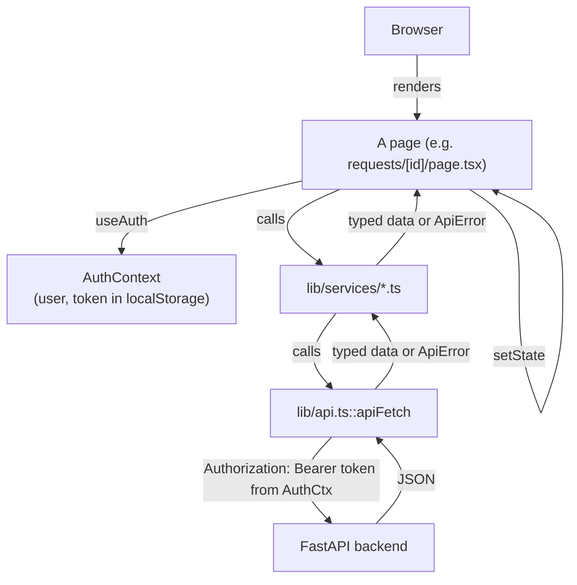

# Phase 6 — Frontend Engineering

## 1. What We Built

A real Next.js frontend where every screen and every action is backed by a real HTTP call to the FastAPI backend — nothing mocked, nothing hardcoded:

- **Authentication**: `/login`, `/register`, a JWT stored in `localStorage`, an `AuthContext` that verifies the token against `GET /api/auth/me` on load (not just trusting whatever's in storage), and role-aware navigation.
- **`/dashboard`**: real counts and five charts (`recharts`), all computed by real backend aggregate queries added this phase.
- **`/requests`**: a paginated, filterable, sortable list — filters live in the URL (`?status=MANUAL_REVIEW`), so views are bookmarkable and shareable, not just clickable.
- **`/requests/new`**: a real create form with client + backend validation, that returns immediately and shows the async pipeline running live.
- **`/requests/[id]`**: the most complete page — request info, AI analysis (with the confidence-is-a-heuristic disclaimer carried through from Phase 4), workflow (assigned team, tasks, triggered rules), the full audit timeline, and — for staff only — manual review actions (retry, status override), all in one page rather than a separate "manual review" screen.
- **`/tasks`**: staff-only task list with status updates.
- **`/rules`**: admin-only workflow rule CRUD.
- Consistent, specific error handling for every status code the spec lists (400/401/403/404/409/422/429/500) plus network failure and backend-unavailable, in one shared `describeError` helper.
- **Backend additions this phase** (real gaps Phase 6 exposed, not decoration): `GET /api/dashboard/summary`, `GET /api/dashboard/metrics`, `GET/PATCH /api/tasks`, a broadened `/retry` endpoint, and `requester_name`/`extracted_entities` added to the single-request response.
- **A real, live-found bug**: the requests/tasks list pages initially ignored their own URL query parameters — navigating to `/requests?status=MANUAL_REVIEW` silently showed all requests instead of filtering. Found by actually clicking through the running app in a browser, not by unit tests (which never construct URLs), and fixed by moving filter state into `useSearchParams`/`router.replace` instead of local `useState`.

Not built: file attachment upload (explicitly deferred — see section 11).

## 2. Why This Phase Exists

Every prior phase built and proved a backend capability with `curl` and pytest. This phase answers a different question: can a real user actually *use* any of it? A backend that's correct but has no usable interface isn't done — and just as importantly, a frontend that *looks* done but calls nothing real is worse than no frontend at all, because it lies about what works. The spec is explicit: "Do not build a frontend that only visually mocks functionality." Every screen in this phase was verified against the live, running backend in an actual browser before being called complete.

## 3. Prerequisites

Phases 1–5 (the whole backend) are assumed. This phase introduces Next.js's App Router, React state/effects, and client-side auth patterns from first principles below — no prior frontend framework experience assumed, per the teaching guide.

## 4. Core Concepts

### Next.js App Router, and why every page here is a Client Component

Next.js's App Router lets a component run on the server (a "Server Component," the default) or in the browser (a "Client Component," opted into with `"use client"` at the top of the file — first used for `BackendStatus.tsx` back in Phase 1). Server Components can't use `useState`, `useEffect`, or browser APIs like `localStorage` — they run once, on the server, before anything reaches the browser. Every page in this app needs to read the JWT from `localStorage` and react to it changing, so every page is a Client Component. This is a deliberate, explainable choice given the architecture (the browser talks to FastAPI directly — see Phase 1's mental model — there's no Next.js server-side data layer to take advantage of Server Components for), not an oversight. A future iteration with server-rendered, SEO-relevant public pages would have a real reason to introduce Server Components; a login-gated internal tool doesn't.

### Routing and the App Router's file convention

Each folder under `frontend/src/app/` maps to a URL segment; a `page.tsx` inside it is what renders there. `app/requests/[id]/page.tsx` is a **dynamic route** — the `[id]` segment becomes a real value (`useParams<{ id: string }>()`) inside the component, which is how `frontend/src/app/requests/[id]/page.tsx` knows *which* request to fetch. `app/layout.tsx` wraps every page (it's where `AuthProvider` and `AppShell` — the nav — get mounted once, rather than repeated on every page).

### React component architecture used here

Three tiers, each with a distinct job:
- **`components/ui/`** — dumb, reusable primitives with no knowledge of FlowForge's domain (`Button`, `Card`, `StatusBadge`, `Spinner`, `Field`, `Pagination`). They'd work in any app.
- **`components/dashboard/`, `components/requests/`, `components/auth/`, `components/layout/`** — domain-aware but still reusable across pages (`Charts.tsx`, `Timeline.tsx`, `RequireAuth.tsx`, `AppShell.tsx`).
- **`app/*/page.tsx`** — the pages themselves: own the data fetching, own the page-specific state, compose the above two tiers.

### Authentication state: `AuthContext`

`frontend/src/contexts/AuthContext.tsx` is a React Context — a way to make `user`, `login`, `register`, `logout` available to any component in the tree without passing them down as props through every intermediate layer ("prop drilling"). On mount, it does something specific and important: if a token exists in `localStorage`, it doesn't just trust it — it calls `GET /api/auth/me` (`authService.getCurrentUser()`) to confirm the token is still valid against the real backend, clearing it if the backend says `401`. A token sitting in storage is a *claim*, not proof; `/me` is the proof.

### Where the token lives, and what that trades away

`frontend/src/lib/auth-storage.ts` stores the JWT in `localStorage`, not a cookie. This is a deliberate, documented choice with a real trade-off: `localStorage` is simple (no cookie flags, no CSRF-token machinery to build), and it fits this app's architecture where the browser calls FastAPI directly rather than through a Next.js server that could set an HttpOnly cookie. The cost: JavaScript running on the page (including, in a worst case, injected malicious script from an XSS vulnerability) can read it — an HttpOnly cookie can't be read by JS at all, which is the standard mitigation for that specific risk. FlowForge doesn't currently render any unsanitized user-generated content as HTML (React escapes text content by default), which limits real XSS exposure — but this trade-off is worth naming explicitly rather than assuming away.

### Protected routes: `RequireAuth`

`frontend/src/components/auth/RequireAuth.tsx` is a client-side guard: while `AuthContext` is still checking for a session (`isInitializing`), it shows a spinner; once resolved, if there's no `user` it redirects to `/login`; if `roles` was passed and the user's role isn't in it, it redirects to `/dashboard`. This is **UX**, not the real security boundary — a person could disable JavaScript or hit the API directly, bypassing this guard entirely. The backend's `require_roles` dependency (Phase 2) is what actually enforces authorization; this component exists so a `USER` never even *sees* an admin page flash on screen, not to stop a determined attacker. Verified live in this session: navigating a regular-`USER` session directly to `/rules` correctly bounced back to `/dashboard`.

### Forms: client validation, backend validation, and the gap between them

`frontend/src/app/requests/new/page.tsx`'s `validate()` function catches empty fields before any network call — fast feedback, no wasted round-trip. But it doesn't duplicate the backend's actual rules (e.g. `RequestCreate`'s field length limits from Phase 2's Pydantic schema) — when the backend rejects something the client validation missed, `ApiError.fieldErrors` (parsed from FastAPI's `422` response shape in `frontend/src/lib/api.ts`) gets displayed the same way a client-side error would. Client validation is a UX nicety; the backend's validation is what's actually enforced — this is why both exist and why they're not required to be identical.

### API communication: one function, one place

Every single backend call in this app goes through `apiFetch` (`frontend/src/lib/api.ts`) — it attaches the `Authorization` header (unless `skipAuth` for login/register), builds the full URL from `NEXT_PUBLIC_API_URL`, and normalizes every failure mode (network failure, any HTTP error status, FastAPI's two different error body shapes for simple vs. validation errors) into one `ApiError` type. Per-resource service modules (`lib/services/requests.ts`, `rules.ts`, `tasks.ts`, `dashboard.ts`, `auth.ts`) wrap `apiFetch` with typed function signatures, so a page calling `requestsService.getRequest(id)` gets a `Promise<BusinessRequestDetail>`, not a raw untyped response.

### TypeScript's role in this project specifically

Every type in `frontend/src/types/` (`request.ts`, `auth.ts`, `rule.ts`, `dashboard.ts`) is a hand-written mirror of a backend Pydantic schema. This isn't automated (no codegen) — it's a deliberate, if imperfect, contract kept in sync by hand. The payoff showed up directly during this build: TypeScript caught the `toNamedCounts`/`buildQuery` generic-typing mismatches (section 12) at compile time, before they could ever reach the browser, and the editor's autocomplete on `request.` inside the detail page prevented several would-be typos in field names that Phase 2's schema actually uses (`assigned_team`, not `assignedTeam`).

### Loading, error, and empty states — treated as first-class, not afterthoughts

Every data-fetching page in this app has explicit branches for: loading (`Spinner`), error (`ErrorBanner` with a message from `describeError`), empty (`"No requests match these filters."` / `"No data yet"` in charts), and success. Skipping any of these is what makes a frontend feel broken even when the backend is fine — a blank white screen while data loads, or a silent no-op when a filter matches nothing, reads as a bug to a user even when no bug exists.

## 5. Mental Model

The frontend has exactly one source of truth for "am I logged in and who am I": `AuthContext`. Everything else — the nav, every protected page, every API call's auth header — reads from that one place (via `useAuth()` or `getToken()`), never maintains its own separate copy of the user/token. When `logout()` runs, there's exactly one thing to clear (`clearToken()` + `setUser(null)`), and every consumer picks up the change on its next render because they all read from the same Context. This single-source-of-truth discipline is also why the app doesn't need Redux or any other state library — the only genuinely global state is auth, and Context is the right-sized tool for that.

## 6. Architecture Diagram

## 7. Request/Data Flow

**"User creates a request" — traced end to end, exactly as verified live in this session** (spec §6.11's required trace):

1. **UI**: the user fills in the form on `/requests/new` (`frontend/src/app/requests/new/page.tsx`) — three controlled inputs (`InputField`/`TextareaField`), each `onChange` updating local `form` state.
2. **React event**: submitting the form fires `handleSubmit`, which first runs `validate(form)` — client-side, no network call — and stops here if any field is empty.
3. **API client**: `requestsService.createRequest(form)` (`frontend/src/lib/services/requests.ts`) calls `apiFetch<BusinessRequest>("/api/requests", { method: "POST", body: JSON.stringify(payload) })`.
4. **HTTP request**: `apiFetch` (`frontend/src/lib/api.ts`) attaches `Authorization: Bearer <token>` (from `getToken()`) and `Content-Type: application/json`, then does the real `fetch()` to `http://localhost:8000/api/requests`.
5. **FastAPI**: `create_request` (`backend/app/api/routes/requests.py`) — validates the body against `RequestCreate` (Phase 2), calls `request_service.create_request` (inserts the row, writes `REQUEST_CREATED`, commits), then `process_request_task.delay(...)` to enqueue the async pipeline, then returns `201` immediately — **before** the pipeline has done anything.
6. **Database**: the insert and audit log write happen in Postgres, in one transaction (Phase 2's design).
7. **Response**: the `201` response with the freshly-created `BusinessRequest` (status `PENDING`, `processing_status: "QUEUED"`) reaches `apiFetch`, which parses it and returns it typed.
8. **Frontend state update**: back in `handleSubmit`, `setSuccess(true)` shows the "submitted, redirecting..." message, then `router.push(`/requests/${created.id}`)` navigates to the detail page — the UI communicates "queued" immediately, exactly per spec's "do not make the user wait for the AI pipeline."
9. **UI update on the detail page**: `frontend/src/app/requests/[id]/page.tsx`'s `load()` fetches the request/timeline/tasks; because `processing_status` is still `QUEUED`, a `setInterval` polling loop (every 3s) keeps refetching. **Live-verified in this session**: within a few seconds, the Celery worker (running in its own container) finished the pipeline, and the next poll picked up `category: ACCESS_REQUEST`, `assigned_team: "IT Security Team"`, a real `WorkflowTask`, and the full audit trail — all without the user refreshing the page.

## 8. Codebase Mapping

| Layer | File | Responsibility |
|---|---|---|
| Auth state | `frontend/src/contexts/AuthContext.tsx` | Session source of truth |
| Token storage | `frontend/src/lib/auth-storage.ts` | localStorage get/set/clear |
| API client | `frontend/src/lib/api.ts` | Single fetch wrapper, error normalization |
| Error messages | `frontend/src/lib/error-messages.ts` | Every HTTP status → a user-safe message |
| Services | `frontend/src/lib/services/*.ts` | Typed, per-resource API calls |
| Types | `frontend/src/types/*.ts` | Hand-mirrored backend schemas |
| Route guard | `frontend/src/components/auth/RequireAuth.tsx` | Client-side auth/role gate |
| Nav | `frontend/src/components/layout/AppShell.tsx` | Role-aware navigation |
| Charts | `frontend/src/components/dashboard/Charts.tsx` | recharts wrappers |
| Pages | `frontend/src/app/*/page.tsx` | One per route |
| Backend: dashboard | `backend/app/services/dashboard_service.py`, `app/api/routes/dashboard.py` | Real aggregate queries |
| Backend: tasks | `backend/app/services/task_service.py`, `app/api/routes/tasks.py` | List/update endpoints |
| Backend: requester display | `backend/app/models/request.py` (`requester_name`/`requester_email` properties), `schemas/request.py` (`RequestDetailRead`) | Denormalized for the detail page |

## 9. File-by-File Walkthrough

Covered inline throughout sections 4, 7, and 8 with concrete references, per the no-code-dump convention.

## 10. Design Decisions

**Why no Redux, Zustand, or other state library?** The only genuinely global, cross-page state is authentication — one Context handles that completely. Every other piece of state (a request list's filters, a form's field values) is local to the page that owns it and doesn't need to be seen anywhere else. Introducing a state library would add a dependency and a learning curve for a problem this app doesn't have — directly matching the spec's explicit instruction not to add one "unless the actual application complexity justifies it."

**Why manual polling instead of a data-fetching library (SWR/React Query)?** Those libraries solve real problems (cache invalidation, request deduplication, background refetching) that this app's scale doesn't yet have — each page fetches its own data once (or polls on an interval when it specifically needs to, like the detail page waiting on the pipeline), and nothing here shares cached data across pages. Introducing one now would be solving a problem FlowForge doesn't have yet, the same reasoning as the Redux decision above.

**Why is the manual review UI part of the request detail page, not a separate `/requests/[id]/review` route?** Spec §6.7 asks for inspecting the request, the AI output, the triggered rules, and taking action — all of which the detail page (§6.6) already fetches and displays. A separate page would either duplicate that fetching logic or need to pass state between routes awkwardly. One page, with a staff-only "Staff Actions" panel shown conditionally by role, is simpler and was explicitly chosen over spec's implied two-page structure — a deliberate simplification, not an oversight.

**Why does `RequireAuth` redirect rather than show a 403 page for a role mismatch?** A `USER` hitting `/rules` isn't being told "you're forbidden" (which reveals the page exists and what it might contain) — they're just quietly routed to somewhere they *are* allowed to be. The backend still returns a real `403` if somehow an unauthorized API call reaches it; the frontend's job here is graceful UX, not the security boundary itself (see section 4).

## 11. Trade-offs

- **No file attachment upload**, despite being listed as an optional field in spec §6.5. Building it properly needs real file storage (a volume or object store), a new backend endpoint, and multipart form handling — meaningful scope for a feature explicitly marked optional, disproportionate to this phase's actual learning goals (Next.js architecture, auth, dashboards, forms, error handling). The create-request form says so directly to the user rather than showing a fake, non-functional upload button.
- **JWT in localStorage, not an HttpOnly cookie** — see section 4's XSS trade-off discussion. A future hardening pass could move to a cookie-based session with a Next.js server-side proxy, at the cost of meaningfully more architecture (the browser would no longer talk to FastAPI directly).
- **No data-fetching cache** — navigating from the requests list to a detail page and back refetches the list from scratch rather than reusing anything. Simple and correct, but not optimized; acceptable at this app's scale.
- **`OPERATOR` sees every task/request, not just "assigned" ones** — this is the same Phase 2/5 data-model simplification (no per-operator assignment exists), now visible in the frontend too: the Tasks page has no "mine" filter because the backend has no concept of "mine" to filter by yet.

## 12. Failure Scenarios

| What failed | How it was discovered | Fix | Lesson |
|---|---|---|---|
| **Requests/Tasks list filters ignored the URL** — `/requests?status=MANUAL_REVIEW` showed every request, not just matching ones | Live testing: navigated directly to that URL in the browser pane and saw all 18 requests instead of 3 | Moved filter state from local `useState` to `useSearchParams()`/`router.replace()` — the URL is now the actual source of truth for filters | Unit tests never exercise "what does a directly-navigated URL with query params render" — only clicking through the UI (or, here, a real browser session) surfaces this class of bug. This is the same lesson as Phase 5's audit-timestamp bug: real, interactive verification catches things pure logic tests structurally cannot. |
| TypeScript rejected passing typed interfaces (`RequestListParams`, `CategoryCount[]`) into functions typed with `Record<string, unknown>` | `npx tsc --noEmit`, before ever running the app | Changed `buildQuery`'s parameter type to plain `object` and `toNamedCounts` to a generic `<T extends { count: number }>(entries: T[], key: keyof T)` | TypeScript interfaces don't structurally satisfy `Record<string, V>` targets even when every property matches — a real, if narrow, TS quirk worth recognizing rather than fighting with `any`. |
| ESLint's `react-hooks/set-state-in-effect` flagged a standard React data-fetching pattern (setting `loading`/`error` synchronously at the top of a fetch effect) | `npx eslint .` | Explicitly disabled per call site with a comment explaining why the pattern is intentional (matches react.dev's own documented examples), rather than silently restructuring around a rule that doesn't fit this codebase's chosen patterns | Not every lint rule fits every valid pattern — the right response to a rule that conflicts with a deliberate, documented choice is an explicit, explained disable, not silence and not blind compliance. |

## 13. Debugging Guide

1. **"I'm logged in but keep getting bounced to /login."** Check `localStorage.getItem("flowforge_token")` in the browser console — is it actually set? Check the Network tab for `GET /api/auth/me` — a `401` there means the token is invalid/expired (backend restarted with a different `JWT_SECRET_KEY`, or the token genuinely expired).
2. **"My filter/page isn't reflected when I share the link."** Check whether that page reads from `useSearchParams()` (URL-synced) or local `useState` (not synced) — see section 12's bug for exactly this class of issue.
3. **"A page shows stale data after an action."** Check whether the action's handler calls `load()`/`reload()` afterward — this app doesn't auto-refresh on mutation; each page explicitly refetches after a create/update/retry.
4. **"TypeScript complains about a type not matching what the backend actually returns."** The types in `frontend/src/types/` are hand-maintained, not generated — when a backend Pydantic schema changes, the matching TypeScript interface has to be updated by hand, in the same PR. Check for drift there first.
5. **General**: `docker compose logs frontend` for build/runtime errors in the container; the browser's own DevTools console/Network tab for anything that happened client-side, which server logs can't show at all.

## 14. Hands-on Exercises

1. Add a `search` text field to the requests list that filters by title (the backend doesn't support this yet — you'll need to add it to `list_requests` in `backend/app/services/request_service.py` first, following the existing `department` `.ilike()` pattern from Phase 2).
2. Make the dashboard auto-refresh every 30 seconds without a manual reload — decide whether to reuse the detail page's polling pattern or introduce something new, and justify your choice.
3. Add a "my tasks" filter for `OPERATOR` — this requires a real data model change (an `assigned_operator_id` on `WorkflowTask`), not just a frontend filter; trace what would need to change in the backend first.
4. Reproduce the URL-filter bug from section 12 yourself: temporarily revert `requests/page.tsx` to use local `useState` for filters, confirm the bug, then restore the fix and explain in writing why `useSearchParams` is the correct fix rather than, say, `sessionStorage`.
5. Build a minimal file attachment feature end to end (backend storage + endpoint + frontend upload UI) — the deferred gap from section 11 — and write up the design trade-offs you made.

## 15. Interview Questions

- Trace "user creates a request" from the first click to the UI showing the routed result — name every file involved, in order.
- Why does this app not use Redux (or any state management library), and what would have to change about the app for that decision to flip?
- What's the actual security difference between storing a JWT in `localStorage` versus an HttpOnly cookie, and which threat does each protect against?
- `RequireAuth` redirects an unauthorized user client-side. Why is that not the real security boundary, and what is?
- Walk through what happens, in the frontend, between a `POST /api/requests` returning `201` and the detail page eventually showing `category: ACCESS_REQUEST`.

## 16. Reverse Explanation Questions

- Explain, using the actual live evidence from this session, why the requests-list filter bug could not have been caught by the backend's pytest suite, no matter how thorough.
- Explain the difference between client-side form validation and backend validation in this app, and why removing either one would be a mistake.
- Explain why `AuthContext` calls `GET /api/auth/me` on load instead of just trusting whatever's in `localStorage`.

## 17. Quiz

1. Which single file does every HTTP call in the frontend pass through, and what three things does it normalize?
2. What's the difference between what `RequireAuth` enforces and what the backend's `require_roles` dependency enforces?
3. True or false: the requests list page fetches all requests and filters them in the browser.
4. Why couldn't `/requests?status=MANUAL_REVIEW` be bookmarked correctly before the fix in section 12 — what was the root cause, precisely?
5. Name two features `apiFetch` handles so that individual pages don't each have to implement them separately.

## 18. Common Misconceptions

- **"Since the frontend has a `RequireAuth` guard, unauthorized users can't reach protected data."** The guard stops the *page* from rendering — it does nothing to stop a direct API call. The backend's own authorization (Phase 2) is what actually protects the data; this was true before Phase 6 existed and remains true now.
- **"TypeScript types guarantee the frontend and backend agree on data shape."** They document an *assumption*, hand-kept in sync — nothing automatically verifies `frontend/src/types/request.ts` still matches `backend/app/schemas/request.py` after a backend change. This is a real, live risk (see section 11), not a solved problem.
- **"Client-side form validation makes backend validation redundant."** The opposite is true: client validation exists purely for fast UX feedback; only the backend's validation is actually trusted or enforced — an API client that skips the frontend entirely (`curl`, a script, a different frontend) still has to go through the real validation.

## 19. Phase Checklist

- [x] Every UI action connects to a real backend endpoint — no mocked functionality
- [x] Authentication, protected routes, and role-aware UI all verified live (register → auto-login → scoped dashboard → role-appropriate nav, confirmed in a real browser session)
- [x] Dashboard shows real aggregate data and real charts — no hardcoded numbers
- [x] Requests list uses real server-side pagination/filtering/sorting, with filters correctly URL-synced (after the live-found-and-fixed bug)
- [x] Create-request flow verified end to end, including watching the async pipeline complete via polling, live
- [x] Request detail page shows AI analysis and workflow decisions as clearly distinct sections
- [x] Manual review / staff actions correctly hidden from non-staff, verified live
- [x] Every spec-listed HTTP error status has a specific, user-safe message
- [x] 125 backend tests still passing; frontend type-checks and lints cleanly

## 20. What I Should Be Able to Explain

1. The complete "create a request" trace, file by file, from click to rendered result.
2. Why this app doesn't need Redux, and what would need to be true for that to change.
3. The real difference between the frontend's route guard and the backend's authorization — and why both exist.
4. How the JWT gets from login into every subsequent API call, concretely.
5. Why the URL-filter bug happened and what class of bug it represents (i.e., what kind of testing does and doesn't catch it).

We'll verify this together when you're ready — and per the spec, this is the one phase where I should not move on until you explicitly confirm understanding.
