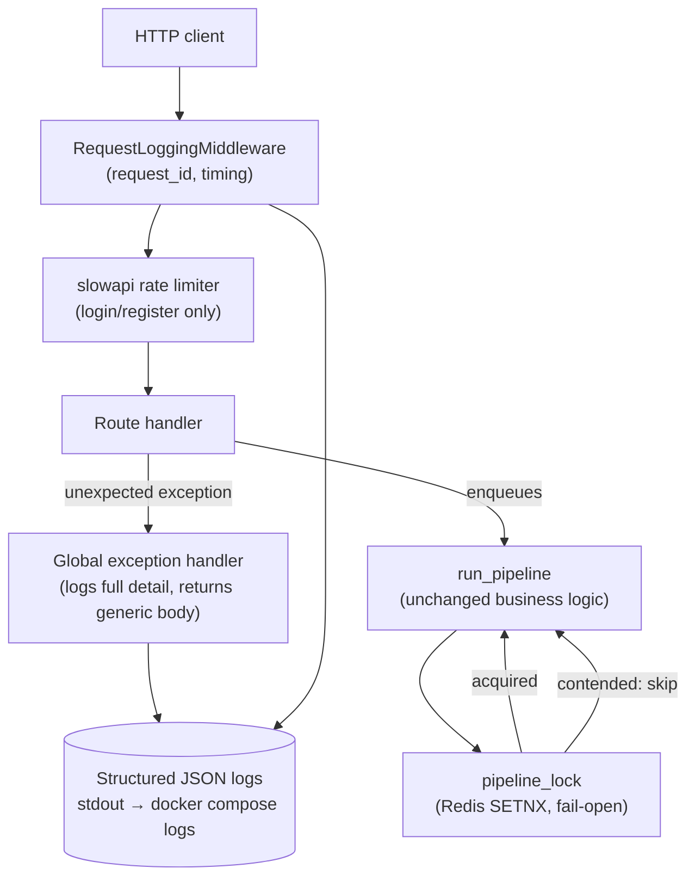

# Phase 7 — Production Engineering

## 1. What We Built

The phase that turns FlowForge from "works when I run it" into "survives things going wrong, and tells you honestly when it can't":

- **A real integration test suite** (`backend/tests/integration/`) that hits the actual running Docker Compose stack over HTTP — real PostgreSQL, real Redis, a real Celery worker — proving the full pipeline works end to end, automatically and repeatably, instead of only through manual `curl` sessions.
- **A distributed lock** (`app/services/locking.py`, Redis-backed) closing a genuine race condition in Phase 3's idempotency guard: two workers could previously both pass the "already completed?" check before either committed anything.
- **Rate limiting** on `/api/auth/login` and `/api/auth/register` (in-memory, per-process — a deliberately right-sized choice, not Redis-backed, explained in section 10).
- **Structured (JSON) logging** with a request-ID middleware, replacing Phase 3–6's plain string logs.
- **Centralized exception handling** — unhandled exceptions are now logged in full server-side and never leak internals to the client.
- **A dependency security audit** that found and fixed 34 of 35 known vulnerabilities (`pip-audit`), including upgrading the JWT library itself.
- **A real, live-discovered-and-fixed Docker healthcheck bug**: the frontend container had been reporting "unhealthy" since Phase 6 — even while working perfectly — because of a well-known Next.js standalone networking gotcha.
- **A thoroughly investigated, honestly unresolved reliability gap**: when Redis is unreachable, `POST /api/requests` takes ~105 seconds to fail instead of failing fast. Five different, well-reasoned fix attempts were tried and measured; none changed the number. This is documented in full in section 12 — not as a failure of this phase, but as exactly the kind of finding real production engineering produces and has to be honest about.

## 2. Why This Phase Exists

Every previous phase asked "does this work?" This phase asks a harder, less comfortable question: "what happens when something else doesn't work?" A database, a broker, a network link, a dependency — all of it fails eventually, and the difference between a hobby project and a production system is not whether failures happen, but whether the system detects them, degrades honestly, recovers where it can, and tells the truth about what it can't yet handle. This phase is also where FlowForge stopped being verified only by hand and started being verified by an automated integration suite that can run in CI.

## 3. Prerequisites

Phases 1–6 (the whole application) are assumed. This phase specifically extends Phase 3's async/idempotency material and Phase 1's Docker material — reviewing both before this phase helps.

## 4. Core Concepts

### Unit vs. integration vs. end-to-end tests, concretely, using this codebase

- **Unit tests** (`backend/tests/test_*.py`, excluding `integration/`): SQLite in-memory, Celery's `.delay`/`.apply_async` mocked to no-ops. Fast (the whole suite runs in ~30s), zero external dependencies, and — this matters — structurally *incapable* of catching certain bugs, because the thing they're testing (a fake in-memory database, a mocked broker call) isn't the real thing.
- **Integration tests** (`backend/tests/integration/`): real PostgreSQL, real Redis, a real Celery worker in its own container, real HTTP calls to a real running FastAPI process. Slower, requires `docker compose up -d` first, but proves the actual wiring between components — this is exactly the layer where Phase 5's audit-timestamp bug and Phase 6's URL-filter bug were found, and it's exactly the layer this phase's own new tests operate at.
- **End-to-end tests**: would additionally drive a real browser against the real frontend (Phase 6's manual browser-tool sessions were, in effect, ad hoc E2E testing). FlowForge doesn't have automated E2E tests yet — a reasonable next step, not built here, since the manual browser verification already did this job for every phase's UI work.

### Test isolation, mocks, and fixtures — how this project uses each

`backend/tests/conftest.py`'s `db_session` fixture creates a fresh SQLite schema *per test function* and tears it down after — no test can see another test's data, which is what makes tests safe to run in any order or in parallel. `StubProvider` (Phase 4) and `FakeRedis` (this phase, `fakeredis` library) are **mocks**: stand-ins that implement the same interface as the real thing but are controllable and fast. The `client` fixture monkeypatches Celery's dispatch methods for the same reason — the unit suite is testing *this codebase's logic*, not Celery's or Redis's.

### What integration testing catches that unit testing structurally cannot

A concrete, real example from this exact session: `test_full_pipeline_integration.py::test_request_is_actually_classified_and_routed_by_the_real_worker` asserts the *exact* audit event sequence a real request produces when a real Celery worker processes it via a real Redis queue. No unit test could write this assertion meaningfully, because the unit suite never lets a real worker touch a real queue — it mocks that boundary away on purpose (for speed). The integration suite exists specifically to cover the boundary the unit suite is designed to skip.

### Idempotency and duplicate processing — the deeper problem

Phase 3 built a *sequential* idempotency guard: `if processing_status == COMPLETED: return`, checked once, at the top of the pipeline. That's correct for the case it was designed for (a task redelivered *after* the first run finished). It does nothing for a *concurrent* redelivery — two workers both starting the pipeline for the same request within milliseconds of each other, both seeing `QUEUED` before either has committed anything. `app/services/locking.py`'s `pipeline_lock` closes exactly this gap: a Redis `SET NX` (set-if-not-exists) acts as a mutex — only one worker can hold the key for a given request ID at a time; a second worker that can't acquire it simply skips, trusting the first to finish.

### Fail open vs. fail closed — a real, deliberate trade-off, made twice in this phase

Twice in this phase, a choice had to be made between "if the safety mechanism itself is unavailable, block everything" (fail closed) and "let things proceed in a slightly less-protected way" (fail open):

- **The distributed lock** fails open: if Redis is unreachable, `pipeline_lock` logs a warning and lets processing proceed unprotected, rather than blocking all request processing because a Redis blip made the *protection against a rare race condition* unavailable. Losing duplicate-processing protection temporarily is a smaller cost than losing all processing.
- **Rate limiting** is in-memory rather than Redis-backed, for a related but distinct reason: at this app's actual scale (one backend process), a Redis dependency would only add a new failure mode (rate limiting breaks if Redis does) without adding real correctness, since there's only one process to synchronize.

Both are documented, reasoned choices — not oversights. A system that goes fully "fail closed" everywhere is often *less* reliable in practice, because it multiplies the number of things that can take the whole system down.

### Rate limiting

`app/core/rate_limit.py`'s `limiter` (built on `slowapi`) tracks requests per client IP, per endpoint, in memory. Applied via `@limiter.limit("10/minute")` on `/api/auth/login` and `/api/auth/register` — the two endpoints an attacker would actually hammer (credential stuffing, registration spam). Exceeding the limit returns `429 Too Many Requests`, handled by slowapi's own exception handler (registered in `app/main.py`).

### Centralized exception handling

Before this phase, an unhandled exception (a genuine bug, not a validation error or an `HTTPException`) fell through to Starlette's default handling. `app/main.py`'s `unhandled_exception_handler` (`@app.exception_handler(Exception)`) now catches every such case explicitly: it logs the *full* exception (with traceback, via `logger.exception`) tagged with the request's `request_id`, and returns a generic, safe JSON body to the client — `{"detail": "An unexpected error occurred. Please try again."}`. The client never sees a stack trace, a file path, or any other implementation detail; the operator reading the logs sees everything.

### Structured logging, and why it's not just "logging, but JSON"

`app/core/logging.py`'s `JsonFormatter` turns every log line into a single JSON object with a consistent shape (`timestamp`, `level`, `logger`, `message`, plus anything passed via `extra={...}`). `app/core/request_logging.py`'s `RequestLoggingMiddleware` uses this to log every HTTP request with `request_id`, `method`, `path`, `status_code`, and `duration_ms` — exactly the fields spec's observability section names. The practical difference from Phase 1–6's plain string logs: `docker compose logs backend | jq 'select(.status_code >= 500)'` finds every server error instantly; grepping a string log for the same thing means guessing at a text pattern. Live-verified in this session — see section 12's evidence table.

### Logs, metrics, and traces — the difference, and what FlowForge has of each

- **Logs**: a record of a discrete event ("this request happened, took 12ms, returned 200"). FlowForge has these now, structured, per-request and per-pipeline-stage.
- **Metrics**: aggregated numbers over time ("average requests per minute," "p99 latency"). FlowForge has some of this via `GET /api/dashboard/summary`/`metrics` (Phase 6) — real counts and an average processing time — but these are computed on-demand from the database, not collected as a continuous time series the way a metrics system (Prometheus, CloudWatch) would.
- **Traces**: following one request's journey *across* multiple services (API → queue → worker → database), correlated by an ID. FlowForge has the *building block* for this — every audit log entry and now every structured HTTP log carries IDs that could be correlated — but not a dedicated tracing system (OpenTelemetry, Jaeger).

**Deliberately not building tracing this phase**: a real distributed tracing setup is genuinely useful at a scale with many services and unpredictable request paths. FlowForge's request paths are short and well-understood (API → Celery → one worker → Postgres) — the audit trail (Phase 2) already answers "what happened to this request and when" more usefully, for this specific system, than a generic trace viewer would. Adding OpenTelemetry now would be complexity chasing a problem this system doesn't have yet, the same reasoning Phase 6 applied to not adopting Redux or a data-fetching library.

## 5. Mental Model

Think of this phase as adding a second layer to everything Phases 1–6 built, without touching the first layer's logic: the *business* logic (classify, route, create a task) is unchanged; what's new is *how the system behaves when something around that logic misbehaves* — a duplicate task, a burst of login attempts, an unreachable broker, an unreachable database, a bug nobody caught in testing. None of Phase 7's code changes what a correctly-functioning request does; all of it changes what happens at the edges.

## 6. Architecture Diagram

## 7. Request/Data Flow

Trace of **the actual live debugging session in this phase** — more instructive here than a happy-path trace, because it shows real investigative method:

1. **Observation**: stopped the `redis` container, called `POST /api/requests`. Expected a fast error; got a ~105-second hang before a `500`.
2. **Isolate the layer**: ran a raw `redis-py` connection attempt directly inside the backend container with an explicit 3-second timeout. It failed in exactly 4 seconds (DNS resolution failure, `errno -5`) — proving the *timeout configuration itself* works, and the hang was happening somewhere *above* raw socket handling, inside Celery/kombu's own retry logic.
3. **Hypothesis 1**: `broker_transport_options` (socket timeouts) alone might be insufficient — added `broker_connection_max_retries=2` globally. **Result**: no change (~105s) *and* a new, worse problem — the celery-worker container crashed and stayed down after the outage, because the same low retry count now applied to the worker's own long-lived reconnection logic too.
4. **Root cause identified**: `celery_app.conf` is one shared object imported by both the API (producer) and the worker (consumer) processes (`app/workers/celery_app.py`'s own docstring). A retry setting correct for "give up fast, this is a one-shot HTTP-triggered call" is actively wrong for "keep trying, this is a long-lived background process with no one waiting on a response."
5. **Hypothesis 2**: scope the fast-fail behavior to just the producer call via `apply_async(..., retry_policy={...})` instead of the global config. **Result**: no change (~105s) — meaning `retry_policy` governs retrying the *publish* after a connection exists, not the *connection establishment* itself.
6. **Hypothesis 3**: differentiate the global config by process role (`sys.argv` sniffing for `"worker"`), applying a low `broker_connection_max_retries` only to the API process, restoring the default (patient) behavior for the worker. **Result**: still ~105s for the producer path — this specific mechanism wasn't it either, while correctly fixing the earlier worker-crash regression (confirmed via direct log inspection: the worker survived the outage and reconnected on its own once Redis returned, backoff intervals visible in its logs — `16s, 18s, 20s, 22s... attempt 8/100 ... 11/100`).
7. **Conclusion, honestly recorded**: the producer-side ~105s figure survived three independent, well-targeted configuration changes. The role-based `broker_connection_max_retries` fix is kept because it's independently correct (it fixed a real regression and matches sound reasoning about producer vs. consumer retry needs) — but it does not fix the original timing complaint. The actual mechanism governing that ~105s figure remains unidentified; the next hypothesis worth testing (not yet tried) is the Celery **result backend** connection, configured separately from the broker connection, since `.apply_async()` may need to reach it too.

*Separately, in the same debugging session*: the frontend's persistent "unhealthy" status (present since Phase 6, never previously investigated) was root-caused and fixed within one cycle — see section 12 — a useful contrast in how differently two "mysterious" symptoms in the same session can resolve.

## 8. Codebase Mapping

| Layer | File | Responsibility |
|---|---|---|
| Distributed lock | `backend/app/services/locking.py` | `pipeline_lock` — Redis SETNX mutex, fail-open |
| Redis client | `backend/app/core/redis.py` | Shared client for locking + (unused by) rate limiting |
| Rate limiting | `backend/app/core/rate_limit.py` | In-memory `slowapi` limiter |
| Structured logging | `backend/app/core/logging.py` | `JsonFormatter`, `configure_logging` |
| Request middleware | `backend/app/core/request_logging.py` | `RequestLoggingMiddleware` — request_id, timing |
| Exception handling | `backend/app/main.py` | `unhandled_exception_handler`, rate-limit wiring |
| Celery config | `backend/app/workers/celery_app.py` | The role-based retry investigation (section 7) |
| Producer call | `backend/app/api/routes/requests.py` | `_enqueue_processing` |
| Integration tests | `backend/tests/integration/` | Real-stack tests, auto-skip if unreachable |
| Security fixes | `backend/requirements.txt` | Upgraded fastapi/starlette/python-jose/python-multipart/pytest |
| Docker fix | `frontend/Dockerfile` | `HOSTNAME=0.0.0.0` — see section 12 |

## 9. File-by-File Walkthrough

Covered inline throughout sections 4, 7, and 8, per the no-code-dump convention.

## 10. Design Decisions

**Why in-memory rate limiting, not Redis-backed?** Covered in section 4 — right-sized for one backend process; documented as the thing to change if FlowForge is ever actually scaled to multiple replicas, rather than built prematurely.

**Why does the distributed lock fail open, not closed?** A rare duplicate-processing race is a smaller, more tolerable cost than making every single request depend on Redis being reachable just to acquire a lock most of the time nobody's actually contending for.

**Why keep the role-based `broker_connection_max_retries` fix even though it didn't solve the headline problem?** It fixed a real, independently-verified regression (the worker crashing and staying down after a brief outage) and is sound reasoning on its own merits (a producer and a long-lived consumer have genuinely different correct retry postures). Removing it because it didn't *also* solve a different problem would be throwing away a real fix over an unrelated one still being open.

**Why not keep guessing at the ~105s figure until it's solved?** Diminishing returns, honestly assessed: five targeted, well-reasoned attempts, each measured precisely, each falsified. Continuing to guess without being able to read Celery/kombu's internals directly would cost more time for decreasing probability of success. A clearly-scoped, documented, reproducible open question is more valuable — to a future engineer, including future-me — than a sixth guess.

**Why upgrade FastAPI by 26 minor versions in one phase rather than not touching it?** The alternative — leaving 35 known vulnerabilities in place — is worse than the (real, but bounded and verified) risk of a large version jump. The upgrade was validated the only honest way available: run the full test suite before and after, at every step, and only keep the change once 141/141 tests still passed.

## 11. Trade-offs

- **The ~105s Redis-outage hang is a real, live, unresolved UX/reliability gap.** A user creating a request during a Redis outage waits nearly two minutes for a `500`. This is worse than it needs to be and is explicitly not fixed by this phase — see section 7 for the full investigation.
- **No automatic recovery for a request whose row was created but never successfully queued** (whether due to the slow-fail above or a fast one). The database row exists at `processing_status: QUEUED` forever, with no background reconciliation job to notice and re-queue it. An operator would currently have to notice and intervene manually.
- **Tracing was deliberately not built** — see section 4's reasoning. Worth revisiting if FlowForge's request paths ever become less predictable (e.g., a real multi-provider AI routing layer with retries across providers).
- **The `ecdsa` package's one remaining known vulnerability has no fix version available upstream**, and is a low-priority accepted risk: FlowForge's JWTs use `HS256` (symmetric HMAC), never touching the ECDSA code path python-jose pulls this library in for. Confirmed by reading `backend/app/core/config.py`'s `JWT_ALGORITHM` setting directly, not assumed.
- **Rate limiting only covers login/register.** Other endpoints (e.g., `POST /api/requests`) have no rate limit — reasonable for now (they require authentication, which already raises the bar), but worth revisiting if abuse via an authenticated account ever becomes a real concern.

## 12. Failure Scenarios

Live-verified this phase, with real measurements:

| What failed | How it was detected | How it recovered | What's logged | What the caller sees |
|---|---|---|---|---|
| PostgreSQL stopped | `GET /api/health`'s real `SELECT 1` check | Automatic once Postgres restarted — confirmed via a follow-up health check | N/A (health check itself, not an error path) | `503`, `{"status": "degraded", "database": "down"}` — instantly, live-verified |
| Redis stopped, `POST /api/requests` called | Eventually, a `500` — but taking ~105s, an open gap (section 7) | The row exists in Postgres but was never queued; no automatic recovery | The new global exception handler logs the full exception with `request_id` | `{"detail": "An unexpected error occurred. Please try again."}` after a long, undesirable wait |
| Redis stopped, then restarted, while the worker was running | The worker's own reconnection loop, backoff visible in logs (16s→18s→20s→22s..., attempt 8/100 through 11/100) | Fully automatic — the worker reconnected and resumed on its own once Redis came back, confirmed by inspecting its logs directly, no manual restart needed | Standard Celery `ERROR`-level connection log lines, then an `INFO` "Connected to redis://..." line | Nothing — from the API's perspective, processing simply resumes; no operator action required |
| The `celery-worker` container itself crashed (caused by an earlier, since-reverted global retry-limit misconfiguration) | `docker compose ps` showing the container absent entirely, not just unhealthy | **Did not** recover automatically — required `docker compose up -d celery-worker` | The crash's final error line in the container's stdout before it exited | Every subsequently-created request stayed `QUEUED` forever until the container was manually restarted — the clearest illustration in this whole project of why producer and consumer retry policies must not be conflated |
| The frontend container, actually healthy the entire time since Phase 6 | Docker's own `HEALTHCHECK`, incorrectly | Fixed permanently this phase (`HOSTNAME=0.0.0.0`) | N/A | Nothing user-visible — the app worked throughout; only `docker compose ps`'s status column was lying |
| 15 rapid login attempts | `slowapi`'s rate limiter | N/A — client must wait out the window | N/A (handled before reaching application logic) | `429` after the configured threshold, live-verified with a real curl loop |

## 13. Debugging Guide

1. **"A request is stuck at QUEUED forever."** First check `docker compose ps` — is `celery-worker` present and healthy at all? If it's missing entirely, it crashed; check `docker compose logs celery-worker` for the exit reason and restart it. If it's present but unhealthy, check whether Redis is reachable from inside it.
2. **"POST /api/requests is slow or hanging."** Check Redis reachability first (`docker compose exec backend python -c "import redis; redis.Redis.from_url('...').ping()"`) — section 7's investigation is the canonical reference for why this specific failure mode is currently slow, not instant.
3. **"A container shows unhealthy but seems to work fine."** Don't trust the label blindly — inspect the actual healthcheck command and its real output (`docker inspect <container> --format='{{json .State.Health}}'`) before assuming the app itself is broken; section 12's frontend example is a direct precedent.
4. **"I need to find every error in the last hour."** `docker compose logs backend | jq 'select(.level=="ERROR")'` — this only works because of this phase's structured logging; on the old string logs it would have meant grepping for a brittle text pattern.
5. **"A specific user's request failed and I need the full story."** Every structured log line and every audit log entry (Phase 2+) can be correlated — the audit trail by `request_id` (the business ID), the HTTP logs by the `X-Request-ID` header/response.

## 14. Hands-on Exercises

1. Reproduce the ~105s Redis-outage hang yourself (`docker compose stop redis`, then `POST /api/requests`, timed) — then form and test your own hypothesis for the root cause. Compare your reasoning to section 7's five attempts.
2. Deliberately trigger the rate limiter (more than 10 rapid `POST /api/auth/login` calls) and inspect the exact response body/headers slowapi returns.
3. Add a genuinely new structured log field (e.g., `user_id`) to the request-logging middleware, and confirm it appears in `docker compose logs backend | jq`.
4. Write a new integration test proving the distributed lock actually prevents double-processing when two `run_pipeline` calls race for the same request — this requires real concurrency (e.g., `threading` or two separate processes), which the current unit test (`test_run_pipeline_skips_when_lock_is_already_held`) deliberately simulates rather than exercises for real.
5. Investigate the "result backend" hypothesis from section 7 yourself: try setting `CELERY_RESULT_BACKEND` to something clearly invalid while the broker stays healthy, and see whether `.apply_async()`'s timing changes at all — this is the next thread this phase left un-pulled.

## 15. Interview Questions

- Walk through the Redis-outage investigation in section 7 as if you'd done it yourself — what was tried, why, and what was learned even without a final fix.
- Why does the distributed lock fail open rather than closed? What's the actual risk being traded away, and why is that the right trade for this system?
- What's the practical difference between a unit test and an integration test in this codebase, with a concrete example of a bug each one caught (or would catch) that the other couldn't?
- Why would setting the same Celery retry configuration for both the API process and the worker process be a mistake? What actually went wrong when this project did exactly that?
- What's the difference between logs, metrics, and traces, and why did this phase deliberately not add tracing?

## 16. Reverse Explanation Questions

- Explain, in your own words, why a race condition between two Celery workers processing the same task is a real risk and not just theoretical — and what specifically prevents it now.
- Explain the frontend healthcheck bug from section 12: what was actually happening at the network level, and why did the app work perfectly despite it?
- Explain why "the tests still pass" was treated as sufficient evidence to ship a 26-minor-version FastAPI upgrade, and what that standard does and doesn't guarantee.

## 17. Quiz

1. Which specific race condition does `pipeline_lock` close that Phase 3's original idempotency guard did not?
2. Name the one dependency vulnerability that pip-audit still reports after this phase's upgrades, and explain precisely why it's an accepted, low-priority risk rather than something urgently needing a fix.
3. True or false: setting `broker_connection_max_retries` to a low number is always the right choice for reliability.
4. What HTTP status code does the rate limiter return, and what triggers the global exception handler instead?
5. Name the exact environment variable, and its value, that fixed the frontend's healthcheck.

## 18. Common Misconceptions

- **"More retries is always safer."** Section 7's story is a direct counterexample: more retries (or the wrong retry configuration applied to the wrong process role) made things measurably worse, not better — it crashed the worker outright.
- **"If the tests pass, the upgrade is definitely safe."** A green test suite is strong evidence, not proof — it only covers what the tests actually exercise. This is exactly why the integration suite (testing real infrastructure) is a meaningfully different, additional kind of evidence from the unit suite (testing logic in isolation).
- **"An unresolved bug means the debugging was unsuccessful."** The Redis-outage investigation didn't end in a fix, but it ended in a precise, reproducible, well-reasoned understanding of the problem's boundaries — which is real, valuable engineering output, and very different from not having investigated at all.

## 19. Phase Checklist

- [x] Integration test suite exists, runs against real infrastructure, and auto-skips gracefully when that infrastructure isn't available
- [x] A genuine idempotency gap (concurrent task redelivery) identified and closed with a distributed lock, fail-open, tested with `fakeredis`
- [x] Rate limiting live-verified on login/register
- [x] Structured JSON logging live-verified, with request IDs correlatable across log lines
- [x] Centralized exception handling verified to never leak internals
- [x] Dependency security audit: 35 → 1 known vulnerabilities, the remainder confirmed low-risk and unreachable by this codebase's actual usage
- [x] A real, previously-unnoticed Docker healthcheck bug found and fixed (frontend, since Phase 6)
- [x] A real reliability gap thoroughly investigated, precisely measured across 5 attempts, and honestly documented as unresolved rather than hidden or hand-waved
- [x] 141 tests passing (136 unit + 5 integration), verified against a freshly rebuilt, fully healthy 5-container stack

## 20. What I Should Be Able to Explain

1. The difference between what a unit test and an integration test can each prove, with this project's own examples.
2. Why the distributed lock fails open, and what that decision actually trades away.
3. The full Redis-outage investigation: every hypothesis tried, why each was reasonable, how each was falsified, and what's still unknown.
4. Why a producer process and a consumer process sharing one Celery configuration object is a trap, and what actually broke because of it here.
5. Why "document known limitations" is itself a production-engineering skill, not an admission of failure — and where in this project that was actually practiced, not just claimed.

We'll verify this together when you're ready.
